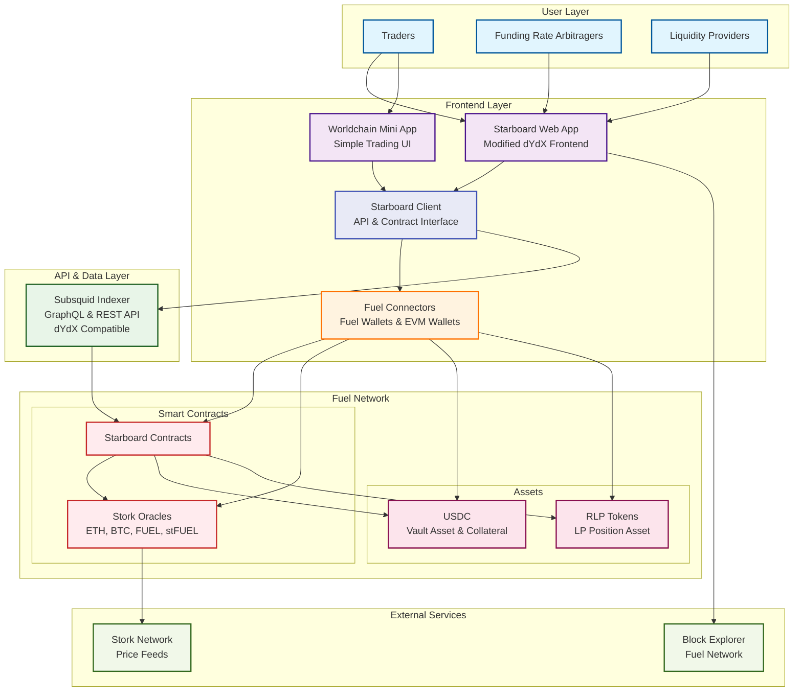

# Starboard Finance Deployment Architecture

## Architecture Overview

This diagram shows the deployment architecture for the Starboard Finance first deliverable, including the modified ruscet contracts on Fuel mainnet, the forked dYdX frontend, and the custom subsquid indexer.

## Component Details

### Frontend Layer
- **Starboard Web App**: Modified dYdX frontend with new branding and Fuel network integration
- **Worldchain Mini App**: Simplified trading interface for the Worldchain mini app store
- **Starboard Client**: Central interface layer that handles all API calls to the data layer and smart contract interactions via fuel-ts-sdk
- **Fuel Connectors**: Handles both Fuel wallets and EVM wallets, providing unified wallet interface

### Data & API Layer
- **Subsquid Indexer**: Single service that processes Fuel network events and provides both GraphQL and REST APIs with dYdX compatibility

### Fuel Network Layer
- **Starboard Contracts**: Updated contracts with USDC-only deposits, no RUSD, RLP positions, and configurable fees (deployed on both mainnet and testnet environments)
- **Stork Oracles**: Price feed integration for supported assets (ETH, BTC, FUEL, stFUEL)
- **Assets**: USDC as primary asset and RLP tokens for liquidity provider positions

### Key Architecture Changes from Original dYdX
1. **Blockchain**: Migrated from Cosmos to Fuel Network
2. **Asset Strategy**: USDC-only vault and collateral system
3. **LP Tokens**: RLP tokens instead of RUSD for liquidity positions
4. **Oracles**: Stork integration for expanded asset coverage
5. **Indexer**: Custom subsquid indexer replacing dYdX's native indexing
6. **Wallet Integration**: Unified Fuel connectors handling both Fuel and EVM wallets

## Data Flow
1. Users interact through web app or mini app
2. Frontend applications route all requests through the Starboard Client
3. Starboard Client handles API calls to the subsquid indexer for read operations
4. Starboard Client manages wallet connections via Fuel connectors for write operations
5. Fuel connectors handle both Fuel wallets and EVM wallets (Worldchain) as unified interface
6. Write operations go through Starboard Client → Fuel connectors → Starboard contracts via fuel-ts-sdk
7. Indexer monitors contract events and updates database
8. Oracles provide real-time price data to contracts
