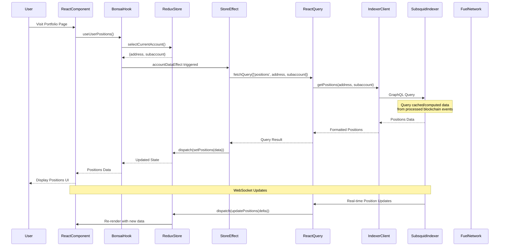
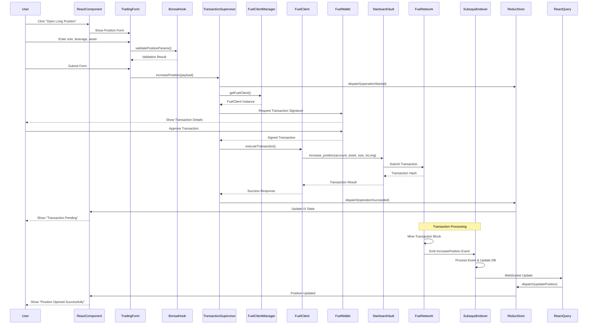
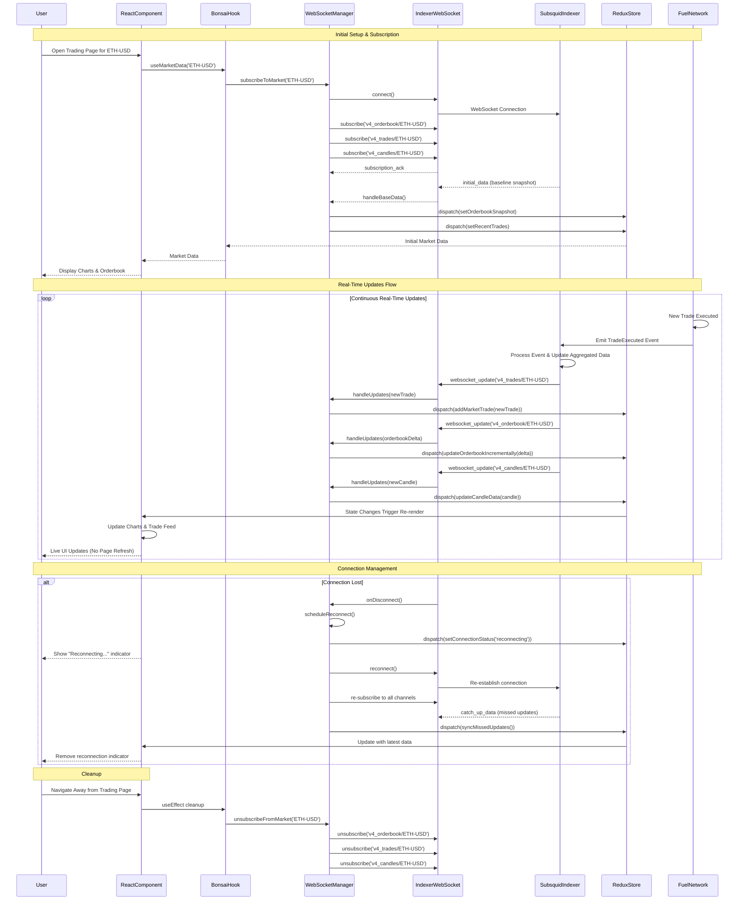

# Starboard Frontend Architecture

## Overview

The Starboard frontend architecture consists of **two distinct layers**: a **standalone TypeScript SDK** (`ts-sdk/`) that handles blockchain interactions, and a **React frontend application** (`src/`) that provides the trading interface. The frontend uses Redux state management with a custom abstraction layer called "Bonsai" and integrates with the Fuel network through the SDK and direct Fuel wallet connections.

## Architecture Diagram

```mermaid
graph TB
    subgraph "Frontend Application (src/)"
        subgraph "React Components Layer"
            PAGES[Trading Pages<br/>Markets, Portfolio, Vaults]
            COMPS[UI Components<br/>Forms, Charts, Dialogs]
            HOOKS[Custom Hooks<br/>Wallet, Trading, Data]
        end
        
        subgraph "Bonsai Abstraction Layer"
            BONSAI[Bonsai Ontology<br/>Data Selectors & Access]
            EFFECTS[Store Effects<br/>Query Management]
            CALC[Calculators<br/>Business Logic]
        end
        
        subgraph "State Management (Redux)"
            STORE[Redux Store<br/>with Persistence]
            SLICES[Redux Slices<br/>Account, Trading, Wallet]
            MIDDLEWARE[Custom Middleware<br/>Localization, App Logic]
        end
        
        subgraph "Frontend API Layer"
            QUERY[React Query<br/>Caching & Sync]
            META[Metadata Service<br/>Asset Info & Charts]
        end
    end

    subgraph "SDK Layer (ts-sdk/)"
        subgraph "Starboard Client SDK"
            COMPOSITE[CompositeClient<br/>Main Trading Client]
            INDEXER_CLIENT[IndexerClient<br/>REST API Client]
            FUEL_CLIENT[FuelClient<br/>Fuel Network Transactions]
            SOCKET[SocketClient<br/>WebSocket Connections]
        end
        
        subgraph "SDK Modules"
            ACCOUNT[Account Module<br/>Subaccount Management]
            COMPOSER[Transaction Composer<br/>Message Building]
            SIGNER[Transaction Signer<br/>Cryptographic Operations]
            WALLET[Local Wallet<br/>HD Key Management]
        end
    end
    
    subgraph "Fuel Wallet Layer"
        FUEL_WALLET[Fuel Connectors<br/>Fuel Network Wallets]
    end
    
    subgraph "External Systems"
        FUEL_NET[Fuel Network<br/>Starboard Contracts]
        INDEXER[Subsquid Indexer<br/>GraphQL & REST API]
        METADATA[Metadata Services<br/>Pricing & Charts]
    end

    %% Frontend internal connections
    PAGES --> HOOKS
    COMPS --> HOOKS
    HOOKS --> BONSAI
    BONSAI --> STORE
    EFFECTS --> QUERY
    EFFECTS --> SLICES
    CALC --> BONSAI
    STORE --> SLICES
    SLICES --> MIDDLEWARE
    
    %% Frontend to SDK connections
    HOOKS --> COMPOSITE
    EFFECTS --> INDEXER_CLIENT
    EFFECTS --> SOCKET
    BONSAI --> COMPOSITE
    
    %% SDK internal connections
    COMPOSITE --> ACCOUNT
    COMPOSITE --> COMPOSER
    COMPOSITE --> SIGNER
    COMPOSITE --> WALLET
    INDEXER_CLIENT --> SOCKET
    FUEL_CLIENT --> COMPOSER
    FUEL_CLIENT --> SIGNER
    
    %% Wallet connections
    HOOKS --> FUEL_WALLET
    
    %% External system connections
    FUEL_WALLET --> FUEL_NET
    INDEXER_CLIENT --> INDEXER
    SOCKET --> INDEXER
    META --> METADATA

    %% Styling
    classDef frontendClass fill:#e1f5fe,stroke:#01579b,stroke-width:2px
    classDef bonsaiClass fill:#f3e5f5,stroke:#4a148c,stroke-width:2px
    classDef stateClass fill:#e8f5e8,stroke:#1b5e20,stroke-width:2px
    classDef sdkClass fill:#fff3e0,stroke:#e65100,stroke-width:2px
    classDef walletClass fill:#fce4ec,stroke:#880e4f,stroke-width:2px
    classDef externalClass fill:#f1f8e9,stroke:#33691e,stroke-width:2px

    class PAGES,COMPS,HOOKS,QUERY,META frontendClass
    class BONSAI,EFFECTS,CALC bonsaiClass
    class STORE,SLICES,MIDDLEWARE stateClass
    class COMPOSITE,INDEXER_CLIENT,FUEL_CLIENT,SOCKET,ACCOUNT,COMPOSER,SIGNER,WALLET sdkClass
    class FUEL_WALLET walletClass
    class FUEL_NET,INDEXER,METADATA externalClass
```



## SDK vs Frontend Application Boundaries

### What's in the SDK Layer (`ts-sdk/`)

**Package**: `@starboard/client-js` - Standalone TypeScript library

**Contents**:
- **Blockchain Clients**: CompositeClient, IndexerClient, FuelClient, SocketClient
- **Transaction Modules**: Account management, transaction composition, signing, broadcasting  
- **Fuel Integration**: Direct Fuel network communication, contract interactions
- **Network Communication**: REST API clients, WebSocket connections
- **Dependencies**: Pure blockchain/crypto libraries (Fuel SDK, Ethers)
- **No React Dependencies**: Can be used in any JavaScript environment

```typescript
// Example SDK usage
import { CompositeClient, IndexerClient, FuelClient } from '@starboard/client-js';

const fuelClient = await FuelClient.connect(fuelEndpoint);
const indexer = new IndexerClient(indexerEndpoint);
```

### What's in the Frontend Application (`src/`)

**Package**: `starboard-frontend` - React-based trading interface

**Contents**:
- **React Components**: Trading forms, charts, market displays, wallet interfaces
- **State Management**: Redux store with application-specific slices and persistence
- **Bonsai Layer**: Business logic abstraction over SDK and state management
- **UI/UX Logic**: Form validation, responsive design, user preferences
- **Fuel Wallet Integration**: Fuel wallet connections and management
- **Dependencies**: React ecosystem (React, Redux, UI libraries)

```typescript
// Example Frontend usage  
import { useAppSelector } from 'state/store';
import { useStarboardClient } from 'hooks/useStarboardClient';

const { fuelClient, compositeClient } = useStarboardClient();
const accountData = useAppSelector(selectAccountData);
```

### Key Separation Principles

1. **SDK is Fuel-focused** - Specialized for Fuel network and Starboard contracts
2. **Frontend is application-specific** - Tailored for Starboard trading interface  
3. **SDK has no UI dependencies** - Pure business logic and network communication
4. **Frontend consumes SDK** - Uses SDK clients through React hooks and Bonsai layer
5. **Clear import boundaries** - Frontend imports SDK, never the reverse

## 1. State Management Architecture

### Redux Store Configuration (`src/state/_store.ts`)

The application uses **Redux Toolkit** with **Redux Persist** for state management:

```typescript
const store = configureStore({
  reducer: createRootReducer(),
  middleware: getDefaultMiddleware({
    serializableCheck: {
      ignoredActions: [FLUSH, REHYDRATE, PAUSE, PERSIST, PURGE, REGISTER],
    },
  }).concat([
    appMiddleware,
    localizationMiddleware,
  ]),
  devTools: process.env.NODE_ENV !== 'production',
});

// Persisted state configuration
const persistConfig = {
  key: 'root',
  storage: storage,
  whitelist: ['account', 'appUiConfigs', 'layout'], // Only persist specific slices
};
```

### Key Redux Slices

#### **Account Slice** (`src/state/account.ts`)
- **User authentication state**
- **Subaccount management**
- **Balance and position tracking**
- **Deposit/withdrawal status**

#### **Wallet Slice** (`src/state/wallet.ts`)
- **Multi-chain wallet connections**
- **Address management**
- **Connection status tracking**
- **Network switching state**

#### **Trading Slices**
- **`perpetuals.ts`**: Market data, positions, orders
- **`tradeForm.ts`**: Trading interface state
- **`transfers.ts`**: Cross-chain transfer management

#### **UI/UX Slices**
- **`appUiConfigs.ts`**: User interface preferences
- **`layout.ts`**: Layout and responsive design state
- **`notifications.ts`**: Toast and alert management

### State Persistence Strategy

```typescript
// Selective persistence to avoid performance issues
const persistWhitelist = [
  'account',           // User authentication and subaccounts
  'appUiConfigs',      // UI preferences and settings
  'layout',            // Layout state and customizations
];

// Sensitive data excluded from persistence
const persistBlacklist = [
  'wallet',            // Wallet connection state (security)
  'perpetuals',        // Market data (stale quickly)
  'notifications',     // Temporary UI notifications
];
```

## 2. Bonsai Abstraction Layer

The **Bonsai system** (`src/bonsai/ontology.ts`) provides a clean abstraction over the Redux store with:

### Data Access Patterns

```typescript
// Centralized selectors with memoization
export const selectCurrentMarketId = createSelector(
  (state: RootState) => state.perpetuals.currentMarketId,
  (marketId) => marketId
);

// Computed selectors for complex data transformations
export const selectAccountEquity = createSelector(
  [selectSubaccountSummary, selectCurrentPositions],
  (summary, positions) => {
    return calculateTotalEquity(summary?.equity, positions);
  }
);

// Hook-based data access
export const useCurrentMarket = () => {
  const marketId = useAppSelector(selectCurrentMarketId);
  const marketsData = useAppSelector(selectPerpetualMarketsData);
  return marketsData?.[marketId];
};
```

### Store Effects System

```typescript
// Reactive query management based on state changes
const createIndexerQueryStoreEffect = (store, config) => {
  return () => {
    const state = store.getState();
    const selectorData = config.selector(state);
    
    if (selectorData) {
      const queryKey = config.getQueryKey(selectorData);
      const queryFn = config.getQueryFn(indexerClient, selectorData);
      
      // Trigger React Query with dynamic key and function
      queryClient.fetchQuery(queryKey, queryFn)
        .then(config.onResult)
        .catch(config.onError);
    } else {
      config.onNoQuery?.();
    }
  };
};
```

## 3. API Integration Architecture

### REST API Layer (`src/bonsai/rest/`)

The REST API system provides structured data fetching with automatic state synchronization:

#### **Market Data APIs**
```typescript
// src/bonsai/rest/markets.ts
const marketsEffect = createIndexerQueryStoreEffect(store, {
  name: 'markets',
  selector: selectNetwork,
  getQueryKey: (network) => ['markets', network],
  getQueryFn: (indexerClient) => () => indexerClient.markets.getPerpetualMarkets(),
  onResult: (markets) => store.dispatch(setPerpetualMarketsData(markets)),
});
```

#### **Account Data APIs**
```typescript
// src/bonsai/rest/fills.ts - Trade history
const fillsEffect = createIndexerQueryStoreEffect(store, {
  name: 'fills',
  selector: selectParentSubaccountInfo,
  getQueryKey: (data) => ['account', 'fills', data.wallet, data.subaccount],
  getQueryFn: (indexerClient, data) => {
    return () => indexerClient.account.getParentSubaccountNumberFills(data.wallet!, data.subaccount!);
  },
  onResult: (fills) => store.dispatch(setAccountFillsRaw(loadableWithData(fills))),
});
```

#### **Query Lifecycle Management**

```typescript
// Automatic cleanup and resource management
const cleanup = () => {
  queryClient.removeQueries({ queryKey });
  subscription?.unsubscribe();
};

// State-driven query activation
useEffect(() => {
  if (shouldActivateQuery) {
    const effect = createQueryEffect();
    const cleanup = effect.start();
    return cleanup;
  }
}, [dependencies]);
```

### WebSocket Integration (`src/bonsai/websocket/`)

Real-time data synchronization using WebSocket connections:

#### **WebSocket Manager** (`lib/indexerWebsocketManager.ts`)

```typescript
class IndexerWebsocketManager {
  // Channel subscription management
  addChannelSubscription({
    channel,
    id,
    handleBaseData,
    handleUpdates,
    handleError
  }) {
    const subscription = {
      channel: `${channel}/${id}`,
      onMessage: (data) => {
        if (data.type === 'subscribed') {
          handleBaseData(data.contents);
        } else if (data.type === 'channel_data') {
          handleUpdates(data.contents);
        }
      }
    };
    
    this.websocket.subscribe(subscription);
    return () => this.websocket.unsubscribe(subscription);
  }

  // Connection health monitoring
  monitorConnection() {
    this.heartbeat = setInterval(() => {
      if (!this.isConnected) {
        this.reconnect();
      }
    }, 30000);
  }
}
```

#### **Real-Time Data Channels**

```typescript
// Market orderbook updates
const orderbookSubscription = websocket.addChannelSubscription({
  channel: 'v4_orderbook',
  id: marketId,
  handleBaseData: (orderbook) => {
    dispatch(setOrderbookSnapshot({ marketId, orderbook }));
  },
  handleUpdates: (updates) => {
    dispatch(updateOrderbookIncrementally({ marketId, updates }));
  }
});

// Live trade feed
const tradesSubscription = websocket.addChannelSubscription({
  channel: 'v4_trades',
  id: marketId,
  handleBaseData: (trades) => {
    dispatch(setMarketTrades({ marketId, trades }));
  },
  handleUpdates: (newTrades) => {
    dispatch(addMarketTrades({ marketId, trades: newTrades }));
  }
});

// Account position updates
const accountSubscription = websocket.addChannelSubscription({
  channel: 'v4_parent_subaccounts',
  id: `${address}/${subaccountNumber}`,
  handleUpdates: (accountData) => {
    dispatch(updateSubaccountData(accountData));
  }
});
```

#### **Message Processing Patterns**

```typescript
// Incremental updates with conflict resolution
const mergeTradeUpdates = (existingTrades, newTrades) => {
  const merged = mergeById(newTrades, existingTrades, (trade) => trade.id);
  return orderBy(merged, [(trade) => trade.createdAt], ['desc']);
};

// State updates with immer for immutability
const updateOrderbook = produce((draft, { asks, bids, messageId }) => {
  asks.forEach(([price, size]) => {
    if (size === '0') {
      delete draft.asks[price];
    } else {
      draft.asks[price] = { size, offset: messageId };
    }
  });
});
```

## 4. Smart Contract Interaction Architecture

### Fuel Wallet Integration

The application connects to the Fuel network through Fuel wallet connectors:

#### **Fuel Wallet Provider** (`src/hooks/`)

```typescript
// Fuel Network Integration (useFuelWallet.ts)
const FuelWalletProvider = () => {
  const fuel = useFuel();
  const { wallet, isConnected } = useWallet();
  
  const connectFuelWallet = async () => {
    await fuel.selectConnector('Fuel Wallet');
    const connection = await fuel.connect();
    const accounts = await fuel.accounts();
    
    dispatch(setFuelWalletState({
      isConnected: true,
      address: accounts[0]?.address,
      accounts: accounts
    }));
  };
  
  const disconnectFuelWallet = async () => {
    await fuel.disconnect();
    dispatch(setFuelWalletState({
      isConnected: false,
      address: null,
      accounts: []
    }));
  };
};
```

### Transaction Management System

#### **Fuel Client Manager** (`src/bonsai/rest/lib/fuelClientManager.ts`)

```typescript
class FuelClientManager {
  // Fuel-specific client resource management
  private clients = new Map<string, ClientInstance>();
  private resourceManager = new ResourceCacheManager();
  
  async getFuelClient(network: FuelNetworkConfig) {
    const cacheKey = `fuel-${network.chainId}`;
    
    return this.resourceManager.getOrCreate(cacheKey, async () => {
      const provider = new Provider(network.fuelNodeUrl);
      const client = new FuelClient(provider);
      return {
        instance: client,
        cleanup: () => client.disconnect()
      };
    });
  }

  // Network switching with cleanup (mainnet/testnet)
  async switchNetwork(newNetwork: FuelNetworkConfig) {
    await this.cleanup();
    this.currentNetwork = newNetwork;
    await this.initialize(newNetwork);
  }
}
```

#### **Transaction Supervisor** (`src/bonsai/AccountTransactionSupervisor.ts`)

```typescript
class AccountTransactionSupervisor {
  // Operation wrapping with error handling
  async wrapOperation<T, P>(
    operationName: string,
    payload: P,
    operation: (clients: FuelClientSet, payload: P) => Promise<T>
  ) {
    try {
      dispatch(operationStarted({ operationName, payload }));
      
      const clients = await this.getFuelClients();
      const result = await operation(clients, payload);
      
      dispatch(operationSucceeded({ operationName, result }));
      return { type: 'success', payload: result };
      
    } catch (error) {
      dispatch(operationFailed({ operationName, error: error.message }));
      return { type: 'failure', errorString: error.message, parsedError: error };
    }
  }

  // Fuel trading operations
  async increasePosition(payload: IncreasePositionPayload) {
    return this.wrapOperation('increasePosition', payload, async ({ fuelClient, wallet }, payload) => {
      const vault = new Vault(payload.vaultContractId, wallet);
      
      return vault.functions.increase_position(
        payload.account,
        payload.collateralAsset,
        payload.indexAsset,
        payload.sizeDelta,
        payload.isLong
      ).call();
    });
  }

  // Liquidity operations
  async depositToVault(payload: DepositPayload) {
    return this.wrapOperation('deposit', payload, async ({ fuelClient, wallet }, payload) => {
      const vault = new Vault(payload.vaultContractId, wallet);
      
      return vault.functions.buy_rusd(
        payload.asset,
        payload.receiver
      ).call();
    });
  }
}
```

### Fuel Contract Integration

The application has complete Fuel smart contract infrastructure:

#### **Contract Type Definitions** (`apps/indexer/src/types/`)

```typescript
// Auto-generated from Fuel contracts
export class Vault extends Contract {
  functions: {
    increase_position: InvokeFunction<[
      account: IdentityInput,
      collateral_asset: AssetIdInput,
      index_asset: AssetIdInput,
      size_delta: BigNumberish,
      is_long: boolean
    ], void>;
    
    decrease_position: InvokeFunction<[
      account: IdentityInput,
      collateral_asset: AssetIdInput,
      index_asset: AssetIdInput,
      collateral_delta: BigNumberish,
      size_delta: BigNumberish,
      is_long: boolean,
      receiver: IdentityInput
    ], BN>;
    
    swap: InvokeFunction<[
      asset_in: AssetIdInput,
      asset_out: AssetIdInput,
      receiver: IdentityInput
    ], BN>;
  };
}
```

#### **Contract Interaction Pattern**

```typescript
// Fuel contract integration
const FuelContractManager = {
  async executeVaultOperation(operation: VaultOperation) {
    const provider = new Provider('https://testnet.fuel.network/v1/graphql');
    const wallet = new WalletUnlocked(privateKey, provider);
    const vault = new Vault(CONTRACT_ID, wallet);
    
    switch (operation.type) {
      case 'increasePosition':
        return vault.functions.increase_position(
          operation.account,
          operation.collateralAsset,
          operation.indexAsset,
          operation.sizeDelta,
          operation.isLong
        ).call();
        
      case 'swap':
        return vault.functions.swap(
          operation.assetIn,
          operation.assetOut,
          operation.receiver
        ).call();
    }
  }
};
```

## 5. Indexer Integration Architecture

### Subsquid-Based Indexer (`apps/indexer/`)

The application uses a **Subsquid** indexer for blockchain data processing:

#### **GraphQL Schema** (`schema.graphql`)

```graphql
# Core trading entities
type Account @entity {
  id: ID!
  address: String! @index
  subaccounts: [Subaccount!]! @derivedFrom(field: "account")
  positions: [Position!]! @derivedFrom(field: "account")
}

type Position @entity {
  id: ID!
  account: Account!
  market: Market!
  side: PositionSide!
  status: PositionStatus!
  size: BigInt!
  entryPrice: BigInt
  unrealizedPnl: BigInt
  realizedPnl: BigInt
  createdAt: BigInt!
  updatedAt: BigInt!
}

type Trade @entity {
  id: ID!
  account: Account!
  market: Market!
  side: OrderSide!
  size: BigInt!
  price: BigInt!
  fee: BigInt!
  createdAt: BigInt!
}

type Market @entity {
  id: ID!
  ticker: String! @index
  oraclePrice: BigInt
  volume24H: BigInt
  trades24H: Int
  status: MarketStatus!
}

# OHLCV candlestick data for charting
type Candle @entity {
  id: ID!
  market: String! @index
  resolution: CandleResolution! @index
  startedAt: BigInt! @index
  open: BigInt!
  high: BigInt!
  low: BigInt!
  close: BigInt!
  usdVolume: BigInt!
}
```

#### **Blockchain Event Processing** (`src/main.ts`)

```typescript
processor.run(new TypeormDatabase(), async (ctx) => {
  for (let block of ctx.blocks) {
    for (let log of block.logs) {
      // Process Vault contract events
      if (log.address === VAULT_CONTRACT_ADDRESS) {
        switch (log.topic0) {
          case 'IncreasePosition':
            await processIncreasePosition(ctx, log);
            break;
          case 'DecreasePosition':
            await processDecreasePosition(ctx, log);
            break;
          case 'Swap':
            await processSwap(ctx, log);
            break;
        }
      }
      
      // Process RLP contract events
      if (log.address === RLP_CONTRACT_ADDRESS) {
        switch (log.topic0) {
          case 'Mint':
            await processRLPMint(ctx, log);
            break;
          case 'Burn':
            await processRLPBurn(ctx, log);
            break;
        }
      }
    }
  }
});
```

### Frontend-Indexer Data Flow

#### **Query-Driven Data Fetching**

```typescript
// Dynamic queries based on application state
const createAccountDataQuery = (address: string, subaccountNumber: number) => {
  return gql`
    query AccountData($address: String!, $subaccount: Int!) {
      account(address: $address) {
        id
        address
        subaccounts(where: { subaccountNumber: $subaccount }) {
          id
          equity
          freeCollateral
          positions {
            id
            market { ticker, oraclePrice }
            side
            size
            entryPrice
            unrealizedPnl
          }
        }
      }
    }
  `;
};

// State-triggered query execution
const accountDataEffect = createIndexerQueryStoreEffect(store, {
  name: 'accountData',
  selector: selectCurrentSubaccountInfo,
  getQueryKey: (data) => ['account', data.address, data.subaccountNumber],
  getQueryFn: (indexerClient, data) => {
    const query = createAccountDataQuery(data.address, data.subaccountNumber);
    return () => indexerClient.query(query, data);
  },
  onResult: (accountData) => {
    store.dispatch(setSubaccountPositions(accountData.account.subaccounts[0].positions));
    store.dispatch(setSubaccountSummary(accountData.account.subaccounts[0]));
  }
});
```

#### **Real-Time Synchronization**

```typescript
// WebSocket subscriptions for live data
const subscribeToAccountUpdates = (address: string, subaccountNumber: number) => {
  const subscription = gql`
    subscription AccountUpdates($address: String!, $subaccount: Int!) {
      accountUpdated(address: $address, subaccountNumber: $subaccount) {
        equity
        positions {
          id
          size
          unrealizedPnl
        }
      }
    }
  `;
  
  indexerWebSocket.subscribe({
    query: subscription,
    variables: { address, subaccount: subaccountNumber },
    next: (data) => {
      store.dispatch(updateSubaccountData(data.accountUpdated));
    }
  });
};
```

## 6. Data Flow Summary

### Complete Data Flow Architecture

```
┌─────────────────┐    ┌──────────────────┐    ┌─────────────────┐
│ Fuel Network    │───▶│   Subsquid       │───▶│   Frontend      │
│ Contract Events │    │   Indexer        │    │   Application   │
└─────────────────┘    └──────────────────┘    └─────────────────┘
         │                       │                       │
         ▼                       ▼                       ▼
┌─────────────────┐    ┌──────────────────┐    ┌─────────────────┐
│ Starboard Logs  │    │ GraphQL API      │    │ Redux Store     │
│ • Position      │    │ • Query Engine   │    │ • Account State │
│ • Trade         │    │ • Subscriptions  │    │ • Market Data   │
│ • Vault Ops     │    │ • Schema         │    │ • UI State      │
└─────────────────┘    └──────────────────┘    └─────────────────┘
                                │                       │
                                ▼                       ▼
                    ┌──────────────────┐    ┌─────────────────┐
                    │ REST & WebSocket │    │ React Components│
                    │ • Markets        │    │ • Trading UI    │
                    │ • Accounts       │    │ • Charts        │
                    │ • Real-time      │    │ • Fuel Wallets  │
                    └──────────────────┘    └─────────────────┘
```

### Key Data Flow Patterns

1. **Fuel Network → Indexer**: Starboard contract events processed by Subsquid into structured data
2. **Indexer → Frontend**: GraphQL queries and WebSocket subscriptions for real-time updates
3. **Frontend State**: Redux manages application state with Bonsai abstraction layer
4. **User Interactions**: Fuel wallet support for transactions on Fuel network
5. **Real-time Updates**: WebSocket connections provide live market data and account updates

## Data Flow Sequence Diagrams

### Read Operation Example: Loading User Positions



### Write Operation Example: Opening a Long Position



### WebSocket Real-Time Updates Example: Live Market Data



## 7. Technology Stack Summary

### **Core Technologies**
- **Frontend Framework**: React 18 with TypeScript
- **Build Tool**: Vite with optimized development experience  
- **State Management**: Redux Toolkit with Redux Persist
- **Styling**: Styled Components + TailwindCSS + Twin.macro
- **UI Components**: Radix UI primitives with custom design system

### **Blockchain Integration**
- **Fuel Network**: `fuels` SDK for smart contract interactions
- **Fuel Wallets**: Fuel connectors for wallet management
- **Starboard Contracts**: Custom TypeScript SDK for perpetuals trading
- **Indexer Integration**: Subsquid-based blockchain data processing

### **Data & API Layer**
- **Indexer**: Subsquid framework for blockchain data indexing
- **GraphQL**: Generated schema with TypeORM database models
- **REST API**: Custom endpoints with React Query caching
- **WebSockets**: Real-time data with automatic reconnection
- **Type Safety**: Comprehensive TypeScript with runtime validation

### **Development & Testing**
- **Testing**: Vitest with React Testing Library
- **Code Quality**: ESLint, Prettier, TypeScript strict mode
- **Development**: Hot reload, mock servers, fake data injection
- **Build**: Optimized production builds with code splitting

## Architecture Summary

This Fuel-focused architecture provides:

### **Clean Separation of Concerns**
- **SDK Layer**: Pure Fuel network communication and contract interactions
- **Frontend Layer**: React-based trading interface with comprehensive state management
- **Clear Boundaries**: No cross-dependencies, SDK can be used independently

### **Fuel Network Integration**
- **Native Fuel Support**: Direct integration with Fuel network and Starboard contracts
- **Wallet Integration**: Fuel wallet connectors for seamless user experience
- **Contract Interactions**: Type-safe contract calls with auto-generated interfaces

### **Real-Time Capabilities** 
- **Live Data**: WebSocket connections for real-time market data and account updates
- **Responsive UI**: Optimistic updates with automatic conflict resolution
- **Performance**: Efficient state management with selective persistence

### **Scalable Foundation**
- **Modular Design**: Clear separation between data layer, business logic, and UI
- **Type Safety**: Comprehensive TypeScript usage throughout the stack
- **Testing Support**: Mock servers and fake data injection for development

This architecture provides a robust, scalable foundation specifically designed for Fuel-based DeFi trading applications with real-time capabilities and comprehensive state management.