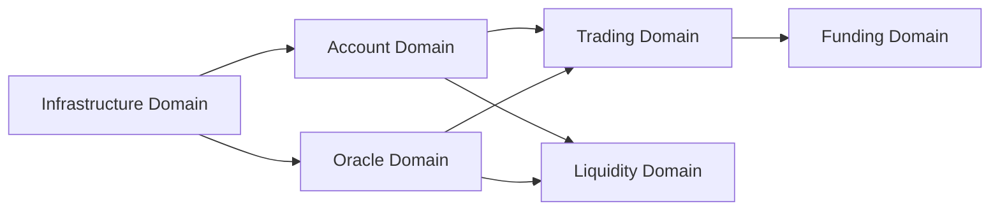

# Domain-Driven Ownership Model

## Overview

This document outlines the domain-driven organization of Starboard Finance, mapping user stories, technical deliverables, and team ownership to business domains. This structure enables clear accountability, parallel development, and vertical slice ownership from smart contracts through SDK to frontend.

## Domain Organization

### 1. Trading Domain

**Domain Owner Responsibilities**: Position management, order execution, market data display, P&L calculations

#### User Stories

- **STAR-107**: Open Long Position (8 pts)
- **STAR-108**: Open Short Position (8 pts)
- **STAR-109**: View Current Positions (5 pts)
- **STAR-110**: Close Positions (6 pts)
- **STAR-111**: View Market Data and Charts (8 pts)
- **STAR-113**: View Trading History (6 pts)

#### Technical Stories

- **STAR-123**: Trading Interface (8 pts)
- **STAR-126**: Charts and Market Data (8 pts)
- **STAR-127**: Analytics and Performance Tracking (7 pts) - _Shared with Liquidity domain_
- **STAR-129**: Position Management Contracts (10 pts)

**Total**: 41 pts user stories + 33 pts technical = **74 story points**

#### Repository Touchpoints

| Subdomain     | Contracts                                    | Indexer                         | SDK                                       | Frontend                  |
| ------------- | -------------------------------------------- | ------------------------------- | ----------------------------------------- | ------------------------- |
| **Positions** | `increase_position()`, `decrease_position()` | Position events, state tracking | Position repository, metrics calculations | Position forms, P&L table |
| **Orders**    | Order matching logic                         | Order events, fills             | Order management service                  | Order entry UI            |
| **Markets**   | Market config storage                        | Market metadata                 | Market data queries                       | Market selector, stats    |

**Detailed Breakdown:**

- **Contracts** (`/contracts/`): Position increase/decrease functions, liquidation logic, collateral management
- **Indexer** (`/indexer/`): Position event processors, fill tracking, market data aggregation
- **SDK** (`/fuel-ts-sdk/src/trading/`): Position metrics service, order management, market data queries
- **Frontend** (`/src/@starboard/trading/`): Trading forms, position tables, market displays, charts

#### Deliverables

- Trading forms (long/short)
- Position table with real-time P&L
- Market data displays
- Trading history view
- Position metrics service (SDK)
- Contract position management functions

#### Code Structure

```
/contracts/src/
├── vault.sw                # Position increase/decrease, liquidations
└── market.sw               # Market configuration

/indexer/src/
├── /processors/trading/
│   ├── positionProcessor.ts
│   ├── orderProcessor.ts
│   └── fillProcessor.ts
└── /models/
    ├── Position.ts
    ├── Order.ts
    └── Fill.ts

/fuel-ts-sdk/src/trading/
├── /src/positions          # Position domain logic
│   ├── domain/
│   ├── services/
│   └── repositories/
├── /src/orders             # Order management
└── /src/markets            # Market configuration

/src/@starboard/trading/
├── /state                  # Redux slice for trading
├── /components             # Trading-specific components
│   ├── PositionForm.tsx
│   ├── PositionsTable.tsx
│   └── TradingHistory.tsx
├── /hooks                  # Trading hooks
│   ├── usePositionMetrics.ts
│   └── useMarketData.ts
├── /effects                # Bonsai effects for trading
└── /calculators            # Trading-specific calculations
```

---

### 2. Liquidity Domain

**Domain Owner Responsibilities**: LP token management, pool operations, fee distribution, LP analytics

#### User Stories

- **STAR-115**: Provide Liquidity (LP) (7 pts)
- **STAR-116**: Withdraw Liquidity (LP) (6 pts)
- **STAR-117**: View LP Performance (6 pts)

#### Technical Stories

- **STAR-127**: Analytics and Performance Tracking (7 pts) - _Shared with Trading domain_
- **STAR-131**: RLP Token System (7 pts)
- **STAR-132**: Fee Configuration (5 pts)

**Total**: 19 pts user stories + 19 pts technical = **38 story points**

#### Repository Touchpoints

| Subdomain | Contracts                               | Indexer                  | SDK                             | Frontend                  |
| --------- | --------------------------------------- | ------------------------ | ------------------------------- | ------------------------- |
| **Pool**  | `add_liquidity()`, `remove_liquidity()` | Pool state, TVL tracking | Pool queries, utilization calcs | LP deposit/withdraw forms |
| **Fees**  | Fee collection, distribution            | Fee event tracking       | Fee calculations                | Fee earnings display      |

**Detailed Breakdown:**

- **Contracts** (`/contracts/`): RLP token minting/burning, pool reserves management, fee collection logic
- **Indexer** (`/indexer/`): LP position events, pool TVL aggregation, fee distribution tracking
- **SDK** (`/fuel-ts-sdk/src/liquidity/`): Pool state queries, RLP value calculations, APY estimations
- **Frontend** (`/src/@starboard/liquidity/`): LP forms, pool analytics dashboard, fee earnings displays

#### Deliverables

- LP deposit/withdrawal forms
- Pool analytics dashboard
- RLP token value tracking
- Fee distribution calculators
- RLP token contracts
- Pool management logic

#### Code Structure

```
/contracts/src/
├── rlp_token.sw            # RLP token contract
├── pool.sw                 # Liquidity pool management
└── fee_distributor.sw      # Fee collection/distribution

/indexer/src/
├── /processors/liquidity/
│   ├── lpPositionProcessor.ts
│   ├── poolProcessor.ts
│   └── feeProcessor.ts
└── /models/
    ├── LiquidityPosition.ts
    ├── Pool.ts
    └── FeeDistribution.ts

/fuel-ts-sdk/src/liquidity/
├── /src/pool               # Pool management logic
│   ├── domain/
│   ├── services/
│   └── repositories/
└── /src/fees               # Fee calculations
    ├── domain/
    └── services/

/src/@starboard/liquidity/
├── /state                  # Redux slice for liquidity
├── /components             # LP-specific components
│   ├── LPDepositForm.tsx
│   ├── LPWithdrawForm.tsx
│   └── PoolAnalytics.tsx
├── /hooks                  # Liquidity hooks
│   ├── usePoolMetrics.ts
│   └── useLPValue.ts
├── /effects                # Pool data effects
└── /calculators            # LP value calculations
```

---

### 3. Funding Domain

**Domain Owner Responsibilities**: Funding rate calculations, payment settlement, funding cost tracking

#### User Stories

- **STAR-114**: Monitor Funding Rates (7 pts)
- **STAR-119**: View Funding Costs (5 pts)

#### Technical Stories

- **STAR-130**: Funding Rate Mechanism (8 pts)

**Total**: 12 pts user stories + 8 pts technical = **20 story points**

#### Repository Touchpoints

| Subdomain       | Contracts                 | Indexer                | SDK                       | Frontend                |
| --------------- | ------------------------- | ---------------------- | ------------------------- | ----------------------- |
| **Calculation** | OI-based rate calculation | Rate history tracking  | Rate queries, predictions | Rate displays, charts   |
| **Settlement**  | 8-hour payment cycles     | Payment event tracking | Payment calculations      | Payment history display |

**Detailed Breakdown:**

- **Contracts** (`/contracts/`): Funding rate calculation based on open interest, periodic payment collection/distribution
- **Indexer** (`/indexer/`): Funding rate event tracking, historical rate storage, payment event processing
- **SDK** (`/fuel-ts-sdk/src/funding/`): Funding rate queries, payment calculations, rate predictions
- **Frontend** (`/src/@starboard/funding/`): Funding dashboard, rate charts, cost calculator

#### Deliverables

- Funding rates dashboard
- Funding cost calculator
- Historical funding rate charts
- Funding rate calculation contracts
- Funding payment settlement system

#### Code Structure

```
/contracts/src/
├── funding_rate.sw         # Rate calculation logic
└── funding_settlement.sw   # Payment distribution

/indexer/src/
├── /processors/funding/
│   ├── fundingRateProcessor.ts
│   └── fundingPaymentProcessor.ts
└── /models/
    ├── FundingRate.ts
    └── FundingPayment.ts

/fuel-ts-sdk/src/funding/
├── /src/calculation        # Rate calculation logic
│   ├── domain/
│   └── services/
└── /src/settlement         # Payment settlement
    ├── domain/
    └── services/

/src/@starboard/funding/
├── /state                  # Redux slice for funding
├── /components             # Funding-specific components
│   ├── FundingRatesDashboard.tsx
│   ├── FundingCostCalculator.tsx
│   └── FundingRateChart.tsx
├── /hooks                  # Funding hooks
│   ├── useFundingRates.ts
│   └── useFundingCosts.ts
└── /calculators            # Funding calculations
```

---

### 4. Oracle Domain

**Domain Owner Responsibilities**: Price feeds, staleness checks, liquidation monitoring

#### User Stories

- _(Embedded in STAR-111 - Market Data)_

#### Technical Stories

- **STAR-133**: Oracle Integration (6 pts)

**Total**: **6 story points**

#### Repository Touchpoints

| Subdomain        | Contracts                           | Indexer                    | SDK                         | Frontend                 |
| ---------------- | ----------------------------------- | -------------------------- | --------------------------- | ------------------------ |
| **Prices**       | Stork integration, staleness checks | Price update events        | Price queries, feed polling | Real-time price displays |
| **Liquidations** | Liquidation threshold checks        | Liquidation event tracking | Position health monitoring  | Liquidation warnings     |

**Detailed Breakdown:**

- **Contracts** (`/contracts/`): Stork oracle integration, price feed validation, staleness checks, liquidation threshold logic
- **Indexer** (`/indexer/`): Price update event tracking, liquidation event processing
- **SDK** (`/fuel-ts-sdk/src/oracle/`): Price feed queries, liquidation threshold calculations
- **Frontend** (`/src/@starboard/oracle/`): Real-time price displays, liquidation warnings

#### Deliverables

- Stork oracle integration
- Price feed validation
- Staleness checks
- Real-time price updates
- Liquidation threshold monitoring

#### Code Structure

```
/contracts/src/
├── oracle_adapter.sw       # Stork oracle integration
└── liquidation.sw          # Liquidation logic

/indexer/src/
├── /processors/oracle/
│   ├── priceUpdateProcessor.ts
│   └── liquidationProcessor.ts
└── /models/
    ├── PriceUpdate.ts
    └── Liquidation.ts

/fuel-ts-sdk/src/oracle/
├── /src/prices             # Price feed integration
│   ├── domain/
│   └── services/
└── /src/liquidations       # Liquidation monitoring
    ├── domain/
    └── services/

/src/@starboard/oracle/
├── /state                  # Redux slice for oracle prices
├── /components             # Price display components
│   ├── PriceDisplay.tsx
│   └── LiquidationWarning.tsx
├── /hooks                  # Price feed hooks
│   ├── useOraclePrices.ts
│   └── useLiquidationStatus.ts
└── /effects                # Real-time price updates
```

---

### 5. Account Domain

**Domain Owner Responsibilities**: Wallet connection, balance management, account dashboard, margin calculations

#### User Stories

- **STAR-106**: View Account Balance and Collateral (3 pts)
- **STAR-112**: Connect Fuel Wallet (4 pts)
- **STAR-118**: Handle Transaction Errors (4 pts)
- **STAR-120**: Select Network (Testnet/Mainnet) (3 pts)

#### Technical Stories

- **STAR-121**: Frontend Project Scaffolding and Setup (5 pts)
- **STAR-122**: Fuel Wallet Integration (6 pts)
- **STAR-124**: Transaction Management System (7 pts)

**Total**: 14 pts user stories + 18 pts technical = **32 story points**

#### Repository Touchpoints

| Subdomain    | Contracts                | Indexer                 | SDK                           | Frontend                    |
| ------------ | ------------------------ | ----------------------- | ----------------------------- | --------------------------- |
| **Accounts** | Account metadata storage | Account creation events | Account queries               | Wallet connection UI        |
| **Balances** | Collateral tracking      | Balance update events   | Balance queries, margin calcs | Balance displays, dashboard |

**Detailed Breakdown:**

- **Contracts** (`/contracts/`): Account metadata, collateral management, margin calculations
- **Indexer** (`/indexer/`): Account event tracking, balance history, transaction history
- **SDK** (`/fuel-ts-sdk/src/account/`): Account queries, balance calculations, wallet integration
- **Frontend** (`/src/@starboard/account/`): Wallet connection, account dashboard, balance displays, network switching

#### Deliverables

- Wallet connection UI
- Account dashboard
- Balance displays
- Network switcher
- Transaction error handling
- Fuel connectors integration

#### Code Structure

```
/contracts/src/
├── account.sw              # Account management
└── collateral.sw           # Collateral tracking

/indexer/src/
├── /processors/account/
│   ├── accountProcessor.ts
│   ├── balanceProcessor.ts
│   └── transactionProcessor.ts
└── /models/
    ├── Account.ts
    ├── Balance.ts
    └── Transaction.ts

/fuel-ts-sdk/src/account/
├── /src/accounts           # Account management
│   ├── domain/
│   └── services/
└── /src/balances           # Balance calculations
    ├── domain/
    └── services/

/src/@starboard/account/
├── /state                  # Redux slice for account/wallet
├── /components             # Account-specific components
│   ├── WalletConnector.tsx
│   ├── AccountDashboard.tsx
│   ├── BalanceDisplay.tsx
│   └── NetworkSwitcher.tsx
├── /hooks                  # Wallet connection hooks
│   ├── useFuelWallet.ts
│   └── useAccountBalance.ts
└── /services               # Transaction management
    └── TransactionSupervisor.ts
```

---

### 6. Infrastructure Domain (Cross-cutting)

**Domain Owner Responsibilities**: Indexer, data polling, CI/CD, monitoring, deployment

#### Technical Stories

- **STAR-125**: Data Integration via Polling (6 pts)
- **STAR-128**: Contract Setup and Deployment (6 pts)
- **STAR-134**: Indexer Setup and Configuration (6 pts)
- **STAR-135**: Event Processing and Data Models (8 pts)
- **STAR-136**: GraphQL API with Data Transformation (7 pts)
- **STAR-137**: Data Polling Infrastructure (5 pts)
- **STAR-138**: CI/CD Pipeline Setup (6 pts)
- **STAR-139**: Infrastructure and Monitoring (8 pts)

**Total**: **52 story points**

#### Repository Touchpoints

| Subdomain      | Contracts                       | Indexer                           | SDK                       | Frontend                    |
| -------------- | ------------------------------- | --------------------------------- | ------------------------- | --------------------------- |
| **Indexer**    | Event emission standards        | All event processors, GraphQL API | IndexerClient integration | Data polling, query hooks   |
| **Deployment** | Deploy scripts, network configs | Deploy scripts, migrations        | Package publishing        | Environment configs         |
| **Monitoring** | Contract events monitoring      | Performance metrics               | Error tracking            | Analytics, error boundaries |

**Detailed Breakdown:**

- **Contracts** (`/contracts/`): Deployment scripts for testnet/mainnet, event emission standards, network configurations
- **Indexer** (`/indexer/`): Subsquid setup, event processors for all domains, GraphQL schema, database models, API resolvers
- **SDK** (`/fuel-ts-sdk/`): IndexerClient, package publishing, type generation from contracts
- **Frontend** (`/src/`): Data polling infrastructure, React Query integration, environment configuration, monitoring setup

#### Deliverables

- Subsquid indexer with GraphQL API
- Data polling system
- Contract deployment scripts
- CI/CD pipelines
- Monitoring and alerting
- Production infrastructure

#### Code Structure

```
/contracts/
├── /scripts/
│   ├── deploy-testnet.sh
│   └── deploy-mainnet.sh
└── /src/                   # Sway contracts

/indexer/
├── /src/processors/        # Event processors (all domains)
│   ├── /trading/
│   ├── /liquidity/
│   ├── /funding/
│   ├── /oracle/
│   └── /account/
├── /src/models/            # Database models
├── /src/graphql/           # GraphQL resolvers
└── squid.yaml              # Subsquid configuration

/fuel-ts-sdk/
├── /src/shared/
│   └── clients/
│       └── IndexerClient.ts
└── package.json            # Publishing config

/src/
├── /bonsai/
│   └── /rest/
│       └── polling.ts      # Data polling infrastructure
└── /lib/
    └── queryClient.ts      # React Query setup

/.github/workflows/
├── contracts-ci.yml
├── indexer-ci.yml
├── sdk-ci.yml
└── frontend-ci.yml

/infrastructure/            # Infrastructure as code (Terraform/CDK)
├── /monitoring/
├── /networking/
└── /databases/
```

---

## Domain Ownership Matrix

| Domain             | Story Points | Primary Dev Skills               | Key Interfaces                        |
| ------------------ | ------------ | -------------------------------- | ------------------------------------- |
| **Trading**        | 74           | React, contracts, financial math | `PositionRepository`, `MarketService` |
| **Liquidity**      | 38           | React, token economics           | `LiquidityPoolService`, `RLPToken`    |
| **Funding**        | 20           | Financial calculations           | `FundingRateCalculator`               |
| **Oracle**         | 6            | Price feeds, monitoring          | `PriceFeedProvider`                   |
| **Account**        | 32           | Wallet integration, React        | `AccountService`, `WalletConnector`   |
| **Infrastructure** | 52           | DevOps, indexing, GraphQL        | `IndexerClient`, `GraphQLSchema`      |

**Total: 222 story points**

---

## Development Team Structure

### Recommended Team Assignment

#### Team A - Trading Core (74 pts)

- **Composition**: 1 Senior Full-Stack Dev (contracts + frontend), 1 Frontend Dev (charts, UI)
- **Focus**: Trading interface, position management, market data
- **Owns**: Trading domain end-to-end

#### Team B - Liquidity & Funding (58 pts)

- **Composition**: 1 Full-Stack Dev (contracts + frontend), 1 Backend/Finance Dev (calculations)
- **Focus**: LP system, funding rates, fee distribution
- **Owns**: Liquidity and Funding domains

#### Team C - Account & Infrastructure (84 pts)

- **Composition**: 1 Full-Stack Dev (wallet integration), 1 DevOps/Backend Dev (indexer, deployment)
- **Focus**: Wallet, indexer, CI/CD, monitoring
- **Owns**: Account and Infrastructure domains

---

## Domain Dependencies



**Critical Path**: Infrastructure → Account → Trading/Liquidity → Funding

### Development Phases

#### Phase 1: Foundation (Weeks 1-3)

- **Infrastructure Domain**: Set up indexer, CI/CD, deployment pipelines
- **Account Domain**: Wallet integration, basic scaffolding
- **Oracle Domain**: Stork integration, price feeds

#### Phase 2: Core Trading (Weeks 4-7)

- **Trading Domain**: Position management, trading interface
- **Liquidity Domain**: LP deposit/withdrawal, RLP tokens

#### Phase 3: Advanced Features (Weeks 8-10)

- **Funding Domain**: Funding rates, payment settlement
- **Trading Domain**: Analytics, trading history
- **Liquidity Domain**: LP performance tracking

---

## Benefits of Domain Ownership

### 1. Clear Accountability

Each team owns their domain end-to-end from smart contracts through SDK to frontend. No ambiguity about who owns what.

### 2. Parallel Development

After infrastructure is ready, Trading and Liquidity domains can develop in parallel with minimal cross-team dependencies.

### 3. Expertise Development

Teams become domain experts, deeply understanding both business logic and technical implementation.

### 4. Easier Code Review

Domain owners review all changes in their domain. They understand the full context and can spot issues quickly.

### 5. Simplified Planning

Stories naturally group by domain, making sprint planning and estimation more straightforward.

### 6. Better Testing

Domain owners write integration tests for their entire vertical slice, ensuring end-to-end functionality.

### 7. Reduced Merge Conflicts

Teams work in separate domain directories, minimizing conflicts and coordination overhead.

### 8. Business Alignment

Code structure maps directly to business capabilities, making it easier for non-technical stakeholders to understand progress.

---

## Cross-Domain Communication

### Shared Interfaces

Domains communicate through well-defined interfaces:

```typescript
// Trading domain needs prices from Oracle domain
import { PriceFeedProvider } from '@/oracle';
// All domains use shared decimal types
import { CollateralAmount, UsdValue } from '@/shared/models/decimals';
// Liquidity domain needs position data from Trading domain
import { PositionRepository } from '@/trading';
```

### Domain Events

For asynchronous communication, use domain events:

```typescript
// Trading domain emits position liquidated event
eventBus.emit('position.liquidated', { positionId, amount });

// Oracle domain listens and updates liquidation metrics
eventBus.on('position.liquidated', handleLiquidation);
```

### Shared Services

Common services live in `/shared/`:

- Decimal calculation utilities
- BigInt math operations
- Type validators (Zod schemas)
- Branded types (Address, AssetId, etc.)

---

## Migration Strategy

### From Current Structure to Domain-Driven

Following the [claude.md](../.claude/claude.md) guidelines on working with forked/legacy code:

1. **Create isolated `@starboard/` root** - Already recommended in guidelines
2. **Organize by domains** instead of technical concerns
3. **ALL new features** go into domain-specific directories
4. **Clone legacy components** into appropriate domains when modifying
5. **Never modify legacy** composites directly

### Incremental Migration

- **Week 1-2**: Set up domain structure, move shared utilities
- **Week 3-4**: Migrate trading features to Trading domain
- **Week 5-6**: Migrate liquidity features to Liquidity domain
- **Week 7+**: Continue with remaining domains

### Legacy Code Strategy

```
/src
├── /[legacy-dydx-fork]     # Frozen - never modify
└── /@starboard             # New domain-organized code
    ├── /trading
    ├── /liquidity
    ├── /funding
    ├── /oracle
    ├── /account
    └── /shared             # Cross-domain utilities
```

---

## Governance

### Domain Owner Responsibilities

1. **Architecture Decisions**: Make technical decisions within domain boundaries
2. **Code Review**: Review all PRs affecting their domain
3. **Documentation**: Maintain domain documentation and ADRs
4. **Testing**: Ensure test coverage for domain functionality
5. **Performance**: Monitor and optimize domain-specific performance
6. **Cross-Domain Coordination**: Communicate with other domain owners on shared interfaces

### Review Process

- **Within Domain**: Domain owner approves (1 approval required)
- **Cross-Domain**: Affected domain owners approve (all affected domains)
- **Shared Code**: Any 2 domain owners approve

---

## Success Metrics

### Per Domain

- **Test Coverage**: >80% for all domain code
- **Build Time**: Domain builds complete in <2 minutes
- **Story Velocity**: Complete stories within estimated points ±20%
- **Bug Rate**: <5 bugs per 100 story points delivered

### Cross-Domain

- **Integration Issues**: <10% of bugs are cross-domain integration issues
- **Merge Conflicts**: <5 merge conflicts per week across all domains
- **Code Review Time**: PRs reviewed within 24 hours
- **Deployment Success**: >95% successful deployments

---

## References

- [User Stories](./user-stories.md) - Detailed user story specifications
- [Frontend Architecture](./frontend-architecture.md) - Technical architecture overview
- [DOMAINS.md](../fuel-ts-sdk/DOMAINS.md) - SDK domain model
- [Development Guidelines](../.claude/claude.md) - Code organization and git workflow
