# Starboard Finance - Comprehensive Project Story Breakdown

## Table of Contents

### [1. Architecture EPIC](#1-architecture-epic)
- [STAR-140: System Architecture Documentation](#star-140-system-architecture-documentation)
- [STAR-141: Sequence Diagrams for User Flows](#star-141-sequence-diagrams-for-user-flows)
- [STAR-142: Architecture Decision Records](#star-142-architecture-decision-records)
- [STAR-143: Entity Relationship Diagram and API Specification](#star-143-entity-relationship-diagram-and-api-specification)
- [STAR-145: Smart Contract ABI Specification](#star-145-smart-contract-abi-specification)
- [STAR-146: Data Flow Diagrams](#star-146-data-flow-diagrams)

### [2. Technical Implementation EPIC](#2-technical-implementation-epic)
- [STAR-148: Subsquid Indexer Infrastructure](#star-148-subsquid-indexer-infrastructure)
- [STAR-151: Monitoring and Observability with Sentry](#star-151-monitoring-and-observability-with-sentry)
- [STAR-152: Vercel Hosting and Deployment](#star-152-vercel-hosting-and-deployment)
- [STAR-157: Pulumi Environment Variable Management](#star-157-pulumi-environment-variable-management)

### [3. Implementation EPIC](#3-implementation-epic)
- [STAR-106: View Account Balance and Collateral](#star-106-view-account-balance-and-collateral)
- [STAR-107: Open Long Position](#star-107-open-long-position)
- [STAR-108: Open Short Position](#star-108-open-short-position)
- [STAR-109: View Current Positions](#star-109-view-current-positions)
- [STAR-110: Close Positions](#star-110-close-positions)
- [STAR-111: View Market Data and Charts](#star-111-view-market-data-and-charts)
- [STAR-112: Connect Fuel Wallet](#star-112-connect-fuel-wallet)
- [STAR-113: View Trading History](#star-113-view-trading-history)
- [STAR-114: Monitor Funding Rates](#star-114-monitor-funding-rates)
- [STAR-115: Provide Liquidity (LP)](#star-115-provide-liquidity-lp)
- [STAR-116: Withdraw Liquidity (LP)](#star-116-withdraw-liquidity-lp)
- [STAR-117: View LP Performance](#star-117-view-lp-performance)
- [STAR-118: Handle Transaction Errors](#star-118-handle-transaction-errors)
- [STAR-119: View Funding Costs](#star-119-view-funding-costs)
- [STAR-120: Select Network (Testnet/Mainnet)](#star-120-select-network-testnetmainnet)

---

## 1. Architecture EPIC

### STAR-140: System Architecture Documentation

**Name**: System Architecture Documentation

**Story**: As a developer, I want comprehensive system architecture documentation so that I can understand the overall system design and make informed technical decisions.

**Task Flow**:
1. Analyze existing Ruscet architecture and DYDX frontend structure
2. Define Starboard's architectural patterns and principles
3. Document component interactions and data flow through Client SDK
4. Create architectural diagrams and documentation
5. Review with team for completeness and accuracy

**Prerequisite Stories**: None

**Prerequisite Technical Stories**: None

**Subtasks**:
- **Architecture Review**
  - Required competencies: Solution Architecture, Systems Design
  - Area of project modified: Documentation
- **Component Mapping**
  - Required competencies: Frontend Architecture, Smart Contract Architecture
  - Area of project modified: Documentation
- **Documentation Creation**
  - Required competencies: Technical Writing, Architecture Documentation
  - Area of project modified: Documentation

### STAR-141: Sequence Diagrams for User Flows

**Name**: Sequence Diagrams for Key User Flows

**Story**: As a developer, I want sequence diagrams for key user flows so that I can understand the interaction patterns between components during critical operations through the Client SDK.

**Task Flow**:
1. Identify critical user flows (trading, LP operations, wallet connection)
2. Map component interactions for each flow through Client SDK
3. Create sequence diagrams using standard notation
4. Document edge cases and error scenarios
5. Review with development team

**Prerequisite Stories**: STAR-140

**Prerequisite Technical Stories**: None

**Subtasks**:
- **Flow Identification**
  - Required competencies: Business Analysis, User Experience
  - Area of project modified: Documentation
- **Sequence Diagram Creation**
  - Required competencies: Systems Design, UML
  - Area of project modified: Documentation
- **Error Flow Documentation**
  - Required competencies: Systems Design, Error Handling
  - Area of project modified: Documentation

### STAR-142: Architecture Decision Records

**Name**: Architecture Decision Records (ADRs)

**Story**: As a developer, I want Architecture Decision Records documenting key technical decisions so that I can understand the rationale behind architectural choices.

**Task Flow**:
1. Identify key architectural decisions made
2. Document context and problem statement for each decision
3. List considered alternatives with pros/cons
4. Record decision and consequences
5. Maintain ADR log for future reference

**Prerequisite Stories**: STAR-140

**Prerequisite Technical Stories**: None

**Subtasks**:
- **ADR Template Creation**
  - Required competencies: Technical Documentation
  - Area of project modified: Documentation
- **Initial ADR Documentation**
  - Required competencies: Architecture, Technical Writing
  - Area of project modified: Documentation
- **Review and Validation**
  - Required competencies: Architecture Review
  - Area of project modified: Documentation

### STAR-143: Entity Relationship Diagram and API Specification

**Name**: Entity Relationship Diagram and API Specification

**Story**: As a developer, I want an Entity Relationship Diagram and comprehensive API documentation so that I can understand the data model and integrate with all system endpoints and GraphQL queries via Subsquid indexer.

**Task Flow**:
1. Analyze smart contract storage structures
2. Map indexer database schema defined by Subsquid configuration
3. Document entity relationships and cardinality
4. Create ERD using standard notation
5. Document GraphQL schema and queries
6. Specify request/response formats
7. Validate with contract and backend developers

**Prerequisite Stories**: STAR-140

**Prerequisite Technical Stories**: None

**Subtasks**:
- **Data Model Analysis**
  - Required competencies: Database Design, Smart Contract Development
  - Area of project modified: Documentation
- **ERD and GraphQL Schema Creation**
  - Required competencies: Data Modeling, GraphQL, API Design
  - Area of project modified: Documentation
- **Schema Documentation and Integration Examples**
  - Required competencies: Technical Writing, Full Stack Development
  - Area of project modified: Documentation

### STAR-145: Smart Contract ABI Specification

**Name**: Smart Contract ABI Specification

**Story**: As a developer, I want detailed smart contract ABI documentation so that I can interact with the contracts correctly and understand their interfaces.

**Task Flow**:
1. Extract ABIs from compiled contracts
2. Document each function's purpose and parameters
3. Specify events and their meanings
4. Document error conditions and revert messages
5. Create integration guide for frontend developers

**Prerequisite Stories**: STAR-140

**Prerequisite Technical Stories**: None

**Subtasks**:
- **ABI Extraction and Documentation**
  - Required competencies: Smart Contract Development, Sway/Solidity
  - Area of project modified: Documentation
- **Event Documentation**
  - Required competencies: Smart Contract Development, Event-Driven Architecture
  - Area of project modified: Documentation
- **Integration Guide Creation**
  - Required competencies: Full Stack Development, Technical Writing
  - Area of project modified: Documentation

### STAR-146: Data Flow Diagrams

**Name**: Data Flow Diagrams

**Story**: As a developer, I want data flow diagrams showing how data moves through the system so that I can understand data transformations and processing pipelines through the Client SDK.

**Task Flow**:
1. Map data sources (blockchain, oracles, user input)
2. Document data transformations at each layer through Client SDK
3. Identify data storage points (no caching)
4. Create data flow diagrams for key processes
5. Document data consistency and synchronization patterns

**Prerequisite Stories**: STAR-140, STAR-143

**Prerequisite Technical Stories**: None

**Subtasks**:
- **Data Pipeline Mapping**
  - Required competencies: Data Architecture, Systems Design
  - Area of project modified: Documentation
- **DFD Creation**
  - Required competencies: Data Modeling, Diagram Tools
  - Area of project modified: Documentation
- **Data Consistency Documentation**
  - Required competencies: Distributed Systems, Data Architecture
  - Area of project modified: Documentation

---

## 2. Technical Implementation EPIC

### STAR-148: Subsquid Indexer Infrastructure

**Name**: Subsquid Indexer Infrastructure for Testnet and Mainnet

**Story**: As a dev, I want Subsquid indexer infrastructure deployed for both testnet and mainnet so that blockchain events can be processed and made available via GraphQL API, handling database configuration and API gateway functionality.

**Task Flow**:
1. Deploy Subsquid processor nodes for testnet and mainnet
2. Configure event processing pipelines
3. Set up GraphQL gateway and API routing
4. Configure database as part of Subsquid configuration
5. Implement auto-scaling policies
6. Configure monitoring and logging

**Prerequisite Stories**: None

**Prerequisite Technical Stories**: None

**Acceptance Criteria**:
- **Functional Requirements**:
  - Subsquid processor running and syncing with Fuel testnet and mainnet networks
  - GraphQL endpoint accessible with proper authentication
  - Database configured automatically through Subsquid setup
  - API gateway functionality handled by indexer
  - Event processing lag < 2 seconds
  - Automatic restart on failure
- **Non-Functional Requirements**:
  - Horizontal scaling based on processing load
  - 99.9% uptime for GraphQL API
  - Comprehensive logging and monitoring
  - Automated deployment via CI/CD

**Subtasks**:
- **Subsquid Deployment for Both Networks**
  - Required competencies: DevOps, Blockchain Infrastructure, Subsquid
  - Area of project modified: Infrastructure
- **GraphQL Gateway Setup**
  - Required competencies: API Infrastructure, GraphQL, Database Configuration
  - Area of project modified: Infrastructure
- **Auto-scaling Configuration**
  - Required competencies: Cloud Infrastructure, Scaling
  - Area of project modified: Infrastructure

### STAR-151: Monitoring and Observability with Sentry

**Name**: Monitoring and Observability with Sentry

**Story**: As a dev, I want Sentry configured for monitoring and observability so that I can track system health, debug issues, and ensure optimal performance.

**Task Flow**:
1. Configure Sentry for error tracking and performance monitoring
2. Set up log aggregation through Sentry
3. Create dashboards and visualizations
4. Set up alerting rules and escalation
5. Integrate with frontend and backend services

**Prerequisite Stories**: None

**Prerequisite Technical Stories**: None

**Acceptance Criteria**:
- **Functional Requirements**:
  - Sentry configured for all services (frontend, indexer)
  - Error tracking with full context and stack traces
  - Performance monitoring for critical paths
  - Custom dashboards for key metrics
- **Non-Functional Requirements**:
  - Real-time error reporting
  - 30-day error retention
  - Alert response time < 1 minute
  - Dashboard load time < 3 seconds

**Subtasks**:
- **Sentry Configuration**
  - Required competencies: DevOps, Monitoring Tools, Sentry
  - Area of project modified: Infrastructure
- **Error Tracking Setup**
  - Required competencies: Error Management, Performance Monitoring
  - Area of project modified: Infrastructure
- **Dashboard Creation**
  - Required competencies: Data Visualization, Monitoring
  - Area of project modified: Infrastructure

### STAR-152: Vercel Hosting and Deployment

**Name**: Vercel Hosting and Deployment

**Story**: As a dev, I want Vercel hosting configured so that the frontend is deployed with CDN, static asset optimization, and automated deployment pipeline.

**Task Flow**:
1. Configure Vercel project for frontend hosting
2. Set up automated deployments from Git
3. Configure custom domains and SSL
4. Optimize build and deployment settings
5. Set up preview deployments for branches

**Prerequisite Stories**: None

**Prerequisite Technical Stories**: None

**Acceptance Criteria**:
- **Functional Requirements**:
  - Vercel project configured with auto-deployments
  - CDN optimization for static assets handled by Vercel
  - HTTPS enforcement
  - Preview deployments for pull requests
- **Non-Functional Requirements**:
  - Global latency < 100ms
  - 99.99% availability
  - Zero-downtime deployments
  - Build time optimization

**Subtasks**:
- **Vercel Project Setup**
  - Required competencies: Frontend Deployment, Vercel
  - Area of project modified: Infrastructure
- **Deployment Configuration**
  - Required competencies: DevOps, CI/CD
  - Area of project modified: Infrastructure
- **Performance Optimization**
  - Required competencies: Web Performance, Frontend Optimization
  - Area of project modified: Infrastructure

### STAR-157: Pulumi Environment Variable Management

**Name**: Pulumi Environment Variable Management

**Story**: As a dev, I want Pulumi configured for environment variable management so that secrets and configuration can be managed securely across different environments.

**Task Flow**:
1. Set up Pulumi project structure
2. Configure environment-specific stacks (dev, staging, production)
3. Implement secrets management
4. Set up automated deployment of configurations
5. Document configuration management process

**Prerequisite Stories**: None

**Prerequisite Technical Stories**: None

**Acceptance Criteria**:
- **Functional Requirements**:
  - Pulumi stacks for each environment
  - Secure secrets management
  - Automated configuration deployment
  - Environment variable injection for all services
- **Non-Functional Requirements**:
  - Secrets encrypted at rest and in transit
  - Configuration changes tracked and auditable
  - Rollback capability for configuration changes
  - Integration with existing CI/CD pipeline

**Subtasks**:
- **Pulumi Project Setup**
  - Required competencies: Pulumi, Infrastructure as Code
  - Area of project modified: Infrastructure
- **Secrets Management Configuration**
  - Required competencies: Security, Secret Management
  - Area of project modified: Infrastructure
- **Environment Configuration**
  - Required competencies: DevOps, Configuration Management
  - Area of project modified: Infrastructure

---

## 3. Implementation EPIC

### STAR-106: View Account Balance and Collateral

**Name**: View Account Balance and Collateral

**Story**: As a trader, I want to view the current balance of my account so that I can understand my available collateral and make informed trading decisions.

**User Flow Diagram**:
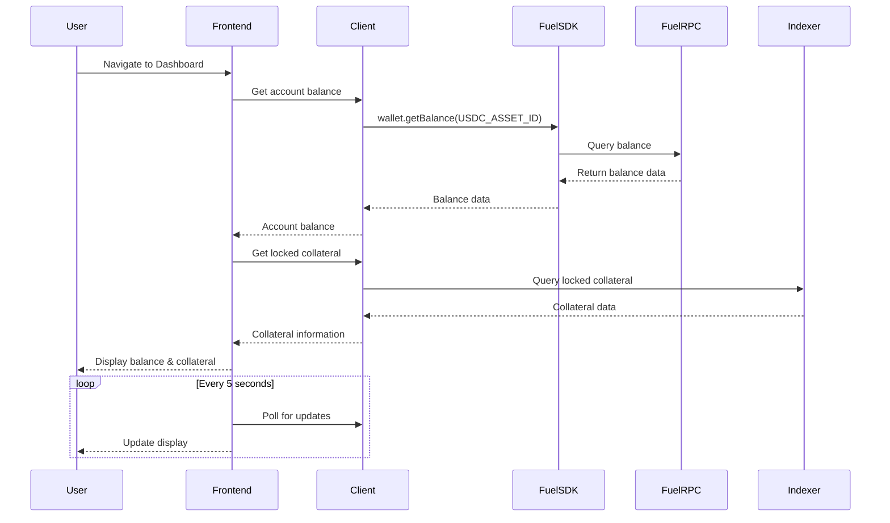

**Task Flow**:
1. Navigate to account/portfolio section
2. View total USDC balance from Fuel RPC via fuel-sdk
3. See available collateral for new positions
4. View used collateral in existing positions from Indexer
5. Check margin utilization percentage
6. Monitor balance updates via polling

**Prerequisite Stories**: STAR-112

**Prerequisite Technical Stories**: 
- Frontend scaffolding and wallet integration
- Client SDK setup with data transformation
- Indexer configuration for balance tracking

**Acceptance Criteria**:
- **Functional Requirements**:
  - Dashboard displays total USDC balance with 6 decimal precision
  - Available collateral calculation: total_balance - used_collateral - pending_orders
  - Used collateral breakdown shows allocation per position with percentages
  - Margin utilization = (used_collateral / total_balance) * 100
  - Balance updates within 5 seconds of on-chain changes via polling
  - Color-coded margin health: green (0-50%), yellow (50-80%), red (80-100%)
  
- **Non-Functional Requirements**:
  - Page load time < 2 seconds
  - Balance query response time < 500ms
  - Polling doesn't cause memory leaks after 24 hours
  - Graceful handling of RPC failures with fallback
  - Unit tests with 90% coverage
  - Integration tests for balance calculations
  - Documented balance calculation formulas

**Unhappy Paths**:
  - Network disconnection shows last known balance with "offline" indicator
  - Contract query failure displays fallback data with timestamp
  - Invalid balance data triggers error boundary with recovery option
  - Negative balance prevention with validation checks

**Subtasks**:

- **Frontend Implementation**
  - Required competencies: React, TypeScript, GraphQL Client
  - Area of project modified: Frontend Dashboard Component
  - Details: Implement balance display component with polling, integrate with wallet connector, create margin utilization visualizations
  
- **Client SDK Integration**
  - Required competencies: Client SDK, Backend Development
  - Area of project modified: Client SDK Layer
  - Details: Balance queries through fuel-sdk, collateral data from indexer, polling optimization
  
- **Smart Contract Integration**
  - Required competencies: Sway/Fuel, Contract Integration
  - Area of project modified: Contract Interfaces
  - Details: Integrate balance query functions via fuel-sdk, handle multiple collateral types
  
- **Testing & QA**
  - Required competencies: Test Automation, E2E Testing
  - Area of project modified: Test Suite
  - Details: Unit tests for calculations, integration tests for data flow, E2E tests for user journey

### STAR-107: Open Long Position

**Name**: Open Long Position

**Story**: As a trader, I want to open long positions on crypto assets (ETH, BTC, FUEL, stFUEL) with leverage so that I can amplify my gains on price increases.

**User Flow Diagram**:
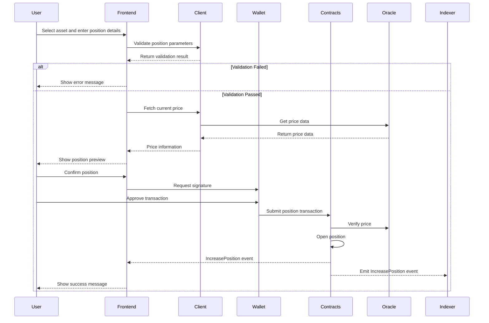

**Task Flow**:
1. Navigate to trading interface for desired asset
2. Select "Long" position side
3. Enter position size in USD
4. Set leverage multiplier (subject to limits)
5. Review position details (collateral required, liquidation price)
6. Submit position order
7. Confirm transaction in wallet
8. Wait for position to open and contract events

**Prerequisite Stories**: STAR-106, STAR-112

**Prerequisite Technical Stories**: 
- Contract position management implementation
- Oracle integration for price feeds
- Trading interface development
- Client SDK transaction management

**Acceptance Criteria**:
- **Functional Requirements**:
  - Support for ETH, BTC, FUEL, stFUEL with correct decimal precision
  - Position size validation: min $10, max $1,000,000
  - Leverage limits: 2x-20x for BTC/ETH, 2x-10x for FUEL/stFUEL
  - Real-time liquidation price calculation: entry_price * (1 - 1/leverage + fees)
  - Transaction completes within 60 seconds or times out with rollback
  - Position appears in portfolio immediately after confirmation
  
- **Non-Functional Requirements**:
  - Price updates every 1 second during position entry
  - Gas estimation accurate within 10%
  - Comprehensive audit trail of position parameters
  - Unit tests for leverage calculations
  - Integration tests for position lifecycle
  - Load testing for 100 concurrent position openings

**Unhappy Paths**:
  - Insufficient collateral shows required amount and deposit option
  - Oracle failure prevents position with safety message
  - Network congestion warning with gas price options
  - Contract paused state shows maintenance message

**Subtasks**:

- **Frontend Development**
  - Required competencies: React, TypeScript, Web3 Integration
  - Area of project modified: Trading Interface Components
  - Details: Position entry form, leverage slider, preview modal, real-time price updates
  
- **Smart Contract Development**
  - Required competencies: Sway/Fuel, DeFi Protocols, Financial Mathematics
  - Area of project modified: Position Manager Contract
  - Details: Implement increase_position function, margin calculations, leverage validation
  
- **Oracle Integration**
  - Required competencies: Blockchain Oracles, Price Feeds
  - Area of project modified: Oracle Interface
  - Details: Integrate Stork oracle feeds, price validation, staleness checks
  
- **Client SDK Processing**
  - Required competencies: Client SDK, Event Processing
  - Area of project modified: Client SDK Services
  - Details: Position event processing, state management, analytics tracking
  
- **QA & Testing**
  - Required competencies: DeFi Testing, Smart Contract Auditing
  - Area of project modified: Test Suite
  - Details: Leverage edge cases, liquidation scenarios, oracle manipulation tests

### STAR-108: Open Short Position

**Name**: Open Short Position

**Story**: As a trader, I want to open short positions on crypto assets (ETH, BTC, FUEL, stFUEL) with leverage so that I can profit from price decreases.

**User Flow Diagram**:
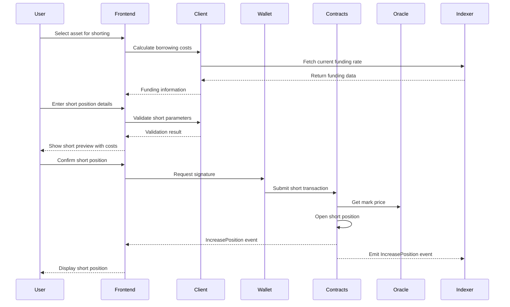

**Task Flow**:
1. Navigate to trading interface for desired asset
2. Select "Short" position side
3. Enter position size in USD
4. Set leverage multiplier (subject to limits)
5. Review position details (collateral required, liquidation price)
6. Submit position order
7. Confirm transaction in wallet
8. Wait for position to open

**Prerequisite Stories**: STAR-106, STAR-112

**Prerequisite Technical Stories**: 
- Contract position management
- Funding rate mechanism
- Oracle integration

**Acceptance Criteria**:
- **Functional Requirements**:
  - Short position interface with same assets as long positions
  - Borrowing cost display: funding_rate * position_size * duration
  - Short liquidation price: entry_price * (1 + 1/leverage - fees)
  - Funding rate display with 8-hour payment cycles
  - Maximum short interest limits per asset
  - Short positions marked distinctly in portfolio (red indicators)
  
- **Non-Functional Requirements**:
  - Funding rate updates every minute
  - Short interest calculations optimized for performance
  - Accurate P&L calculations including funding costs
  - Stress testing for extreme market conditions
  - Documentation of short position mechanics
  - Integration tests for funding payments

**Unhappy Paths**:
  - Maximum short interest reached shows current limit
  - Negative funding rate clearly explained to user
  - Insufficient liquidity for short prevents position
  - Funding payment failure triggers liquidation warning

**Subtasks**:

- **Frontend Development**
  - Required competencies: React, TypeScript, DeFi Interfaces
  - Area of project modified: Trading Components
  - Details: Short position form, funding rate display, cost calculator
  
- **Smart Contract Development**
  - Required competencies: Sway/Fuel, DeFi Mathematics
  - Area of project modified: Position Manager Contract
  - Details: Short position logic, funding rate integration, borrowing mechanics
  
- **Funding Rate Integration**
  - Required competencies: DeFi Protocols, Financial Engineering
  - Area of project modified: Funding System
  - Details: Funding rate calculations, payment collection
  
- **QA & Testing**
  - Required competencies: DeFi Testing, Risk Analysis
  - Area of project modified: Test Suite
  - Details: Short squeeze scenarios, funding payment edge cases

### STAR-109: View Current Positions

**Name**: View Current Positions

**Story**: As a trader, I want to view my current positions, including size, leverage, PnL, and margin requirements so that I can monitor my portfolio performance and risk.

**User Flow Diagram**:
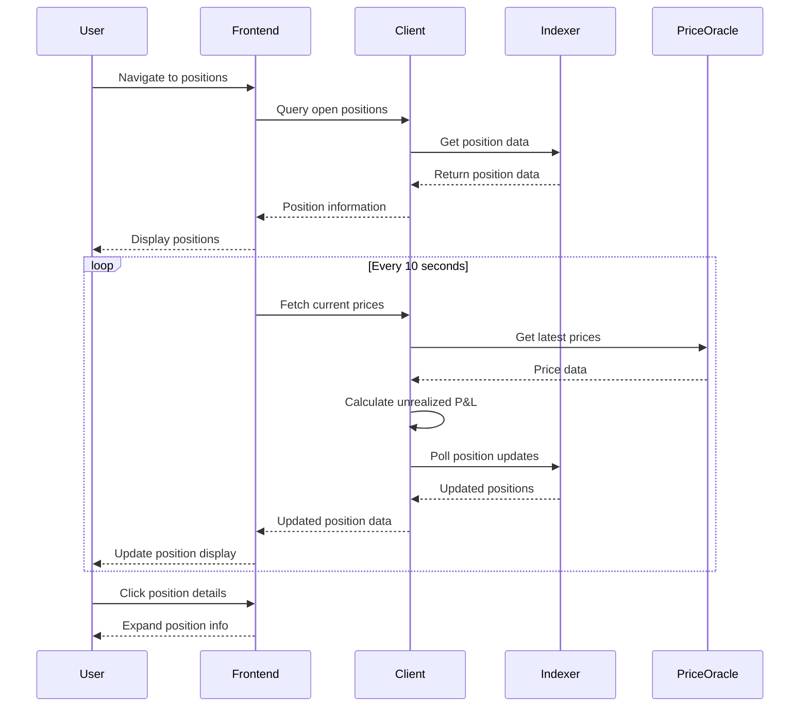

**Task Flow**:
1. Navigate to portfolio/positions section
2. View list of all open positions via Client SDK
3. See position details: asset, side, size, leverage
4. Monitor PnL via periodic polling (realized and unrealized)
5. Check margin requirements and liquidation prices
6. View position history and performance metrics

**Prerequisite Stories**: STAR-107, STAR-108

**Prerequisite Technical Stories**: 
- Client SDK position data processing
- Real-time P&L calculation system with polling

**Acceptance Criteria**:
- **Functional Requirements**:
  - Position table with sortable columns: Asset, Side, Size, Leverage, Entry Price, Mark Price, P&L, ROE
  - Unrealized P&L: (mark_price - entry_price) * size * side_multiplier
  - ROE (Return on Equity): unrealized_pnl / initial_margin * 100
  - Margin ratio with visual indicators: safe (>50%), warning (20-50%), danger (<20%)
  - Expandable rows showing: entry time, funding paid/received, fees paid, liquidation price
  - Position grouping by asset with aggregate statistics
  
- **Non-Functional Requirements**:
  - Position updates every 10 seconds via polling
  - P&L calculations accurate to 6 decimal places
  - Table renders 100+ positions without lag
  - Mobile-responsive table design
  - Real-time price feeds integrated

**Unhappy Paths**:
  - Price feed failure shows last known prices with timestamp
  - Large position count triggers pagination
  - Calculation errors show fallback to contract data
  - Network issues maintain local state with sync indicator

**Subtasks**:

- **Frontend Implementation**
  - Required competencies: React, TypeScript, Table Components
  - Area of project modified: Portfolio Components
  - Details: Position table, P&L calculations, real-time updates via polling
  
- **Client SDK Integration**
  - Required competencies: Client SDK, Real-time Data
  - Area of project modified: Client SDK Layer
  - Details: Position aggregation, P&L calculations, performance metrics
  
- **Data Processing**
  - Required competencies: Data Engineering, Event Processing
  - Area of project modified: Indexer
  - Details: Position event processing, state reconstruction
  
- **QA & Testing**
  - Required competencies: Frontend Testing, Data Validation
  - Area of project modified: Test Suite

### STAR-110: Close Positions

**Name**: Close Positions

**Story**: As a trader, I want to close my positions partially or fully to realize profits or cut losses and manage my portfolio risk.

**User Flow Diagram**:
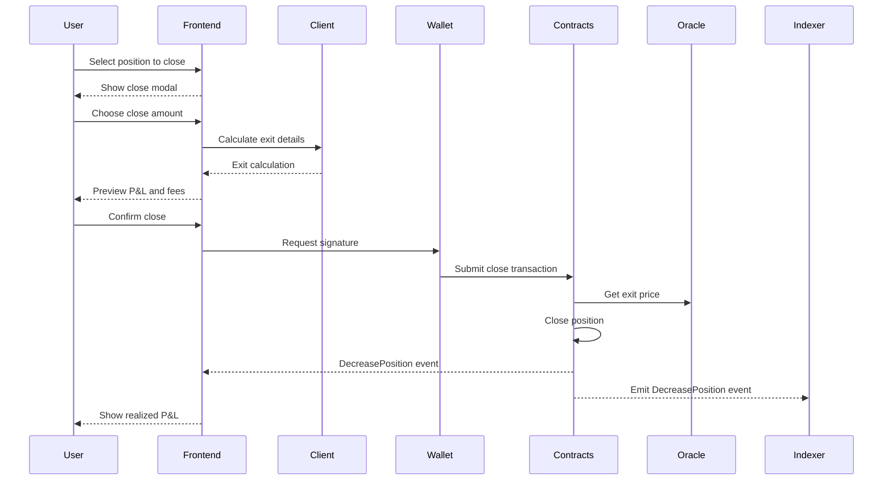

**Task Flow**:
1. Navigate to open position
2. Select "Close Position" action
3. Choose close amount (partial or full)
4. Review closing details (exit price, fees, final PnL)
5. Submit close position transaction
6. Confirm transaction in wallet
7. Wait for position closure and contract events

**Prerequisite Stories**: STAR-109

**Prerequisite Technical Stories**: 
- Position closure functionality in contracts
- Client SDK transaction management

**Acceptance Criteria**:
- **Functional Requirements**:
  - Close modal with slider for partial close (25%, 50%, 75%, 100%, custom)
  - Exit price estimation
  - Fee breakdown: trading fee, funding fee (if any), network fee
  - Final P&L calculation: (exit_price - entry_price) * size - total_fees
  - Position closure confirmation within 60 seconds
  - Portfolio automatically updates after closure
  - Transaction history entry created with all details
  
- **Non-Functional Requirements**:
  - Closure transaction gas optimization
  - Partial close minimum: $10 or 10% (whichever is greater)
  - Success rate monitoring for closures
  - Automated testing for partial close scenarios
  - Documentation of closure mechanics

**Unhappy Paths**:
  - Insufficient gas shows required amount
  - Contract pause prevents closure with explanation
  - Partial close leaving dust amount prevented

**Subtasks**:

- **Frontend Development**
  - Required competencies: React, TypeScript, Transaction UI
  - Area of project modified: Position Management Components
  - Details: Close modal, partial close slider, P&L preview
  
- **Smart Contract Development**
  - Required competencies: Sway/Fuel, DeFi Protocols
  - Area of project modified: Position Manager Contract
  - Details: Implement decrease_position function, partial close logic
  
- **Client SDK Processing**
  - Required competencies: Client SDK, Transaction Management
  - Area of project modified: Client SDK System
  - Details: Transaction management integration, event handling
  
- **QA & Testing**
  - Required competencies: DeFi Testing, Transaction Testing
  - Area of project modified: Test Suite

### STAR-111: View Market Data and Charts

**Name**: View Market Data and Charts

**Story**: As a trader, I want to view price charts and market data (updated via polling) for the assets I'm trading so that I can make informed trading decisions.

**User Flow Diagram**:
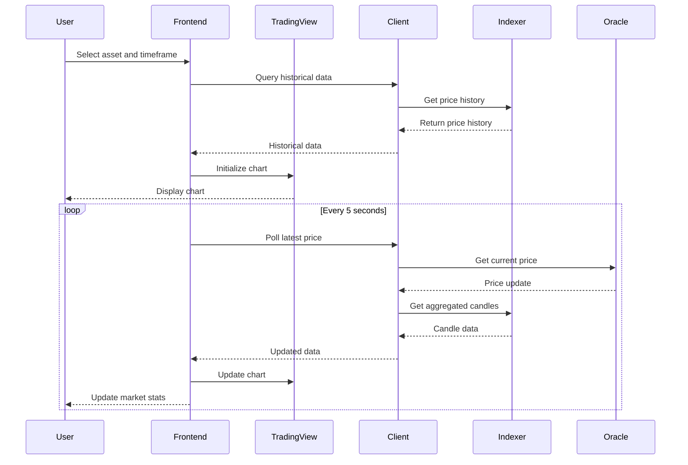

**Task Flow**:
1. Navigate to trading interface for specific asset
2. View price chart with different timeframes (updated via polling)
3. See current bid/ask prices and spread
4. Monitor 24h volume and price change
5. Access technical indicators and drawing tools

**Prerequisite Stories**: None

**Prerequisite Technical Stories**: 
- Oracle integration
- Charts infrastructure setup

**Acceptance Criteria**:
- **Functional Requirements**:
  - TradingView Advanced Charts integration
  - Timeframes: 1m, 5m, 15m, 30m, 1h, 4h, 1d, 1w
  - Market stats: 24h volume, high, low, price change %, open interest
  - Technical indicators: MA, EMA, RSI, MACD, Bollinger Bands (minimum)
  - Drawing tools: trendlines, horizontal lines, fibonacci
  - Price updates every 5 seconds via polling through Client SDK
  - Chart data persistence in localStorage
  
- **Non-Functional Requirements**:
  - Chart load time < 2 seconds
  - Smooth chart performance with 10,000+ candles
  - Mobile-responsive chart interface
  - Offline chart viewing with cached data
  - Chart library bundle size < 500KB

**Unhappy Paths**:
  - Missing historical data shows available range
  - Price feed interruption maintains last known state
  - Chart library load failure shows basic price display
  - Invalid timeframe selection defaults to 1h

**Subtasks**:

- **Frontend Implementation**
  - Required competencies: React, TradingView, TypeScript
  - Area of project modified: Chart Components
  - Details: TradingView integration, custom indicators, toolbar
  
- **Data Pipeline**
  - Required competencies: Data Engineering, Time-series Data
  - Area of project modified: Client SDK Services
  - Details: OHLCV data aggregation, historical data storage, polling infrastructure
  
- **Price Feed Integration**
  - Required competencies: Real-time Data, Client SDK
  - Area of project modified: Client SDK Layer
  - Details: Real-time price subscription, data transformation through Client
  
- **QA & Testing**
  - Required competencies: Frontend Testing, Performance Testing
  - Area of project modified: Test Suite

### STAR-112: Connect Fuel Wallet

**Name**: Connect Fuel Wallet

**Story**: As a trader, I want to connect my Fuel wallet to the platform to manage my trades and interact with the Fuel network securely.

**User Flow Diagram**:
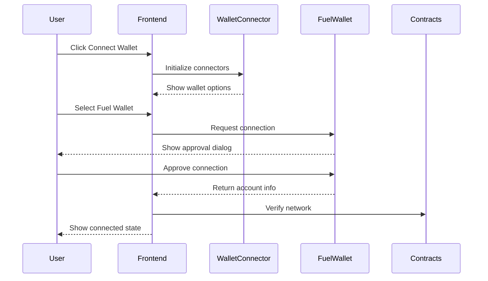

**Task Flow**:
1. Visit Starboard Finance platform
2. Click "Connect Wallet" button
3. Select Fuel wallet from connector options
4. Authorize connection in wallet app
5. Confirm account selection

**Prerequisite Stories**: None

**Prerequisite Technical Stories**: 
- Frontend project setup

**Acceptance Criteria**:
- **Functional Requirements**:
  - Support for Fuel Wallet, WalletConnect compatible wallets
  - Account address displayed in truncated format (0x1234...5678)
  - Network validation ensuring correct chain (testnet/mainnet)
  - Multi-account support with easy switching
  - Disconnect functionality clearing all session data
  - Auto-reconnect on page refresh if previously connected
  - Connection state persisted in localStorage
  
- **Non-Functional Requirements**:
  - Connection process < 5 seconds
  - Secure storage of connection metadata
  - No private keys stored in browser
  - Graceful handling of wallet rejection
  - Mobile wallet support via deep linking
  - Browser extension detection

**Unhappy Paths**:
  - No wallet installed shows installation guide
  - Wrong network prompts network switch
  - Connection timeout after 30 seconds
  - Wallet locked requires unlock prompt
  - Multiple wallets shows selection modal

**Subtasks**:

- **Frontend Components**
  - Required competencies: React, TypeScript, Web3, Fuel SDK
  - Area of project modified: Header and Auth Components
  - Details: Connection modal, account display, network indicator, wallet state management, connection persistence

### STAR-113: View Trading History

**Name**: View Trading History

**Story**: As a trader, I want to see my trading history and performance metrics so that I can analyze my trading patterns and improve my strategy.

**User Flow Diagram**:
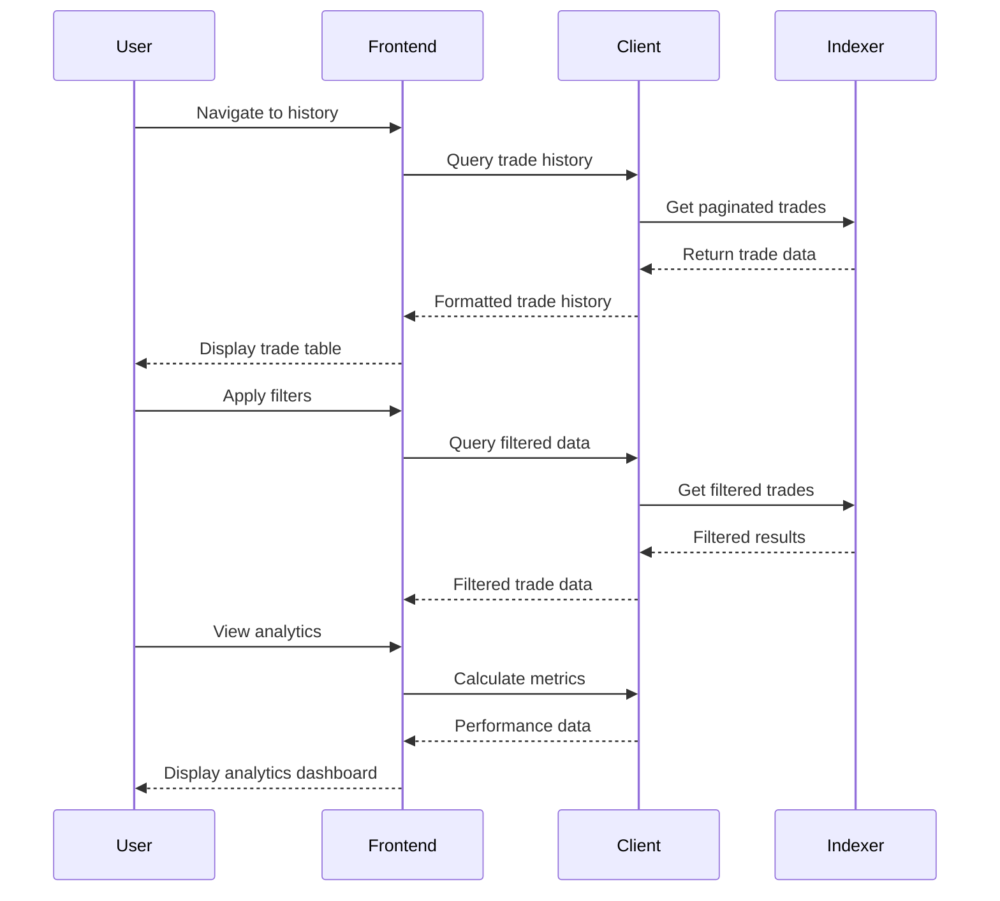

**Task Flow**:
1. Navigate to account/history section
2. View chronological list of all trades through Client SDK
3. Filter by date range, asset, or trade type
4. See trade details: open price, close price, size, fees, PnL
5. View aggregate performance statistics calculated in Client (bonsai layer)

**Prerequisite Stories**: STAR-107, STAR-108, STAR-110

**Prerequisite Technical Stories**: 
- Trade history processing in indexer
- Client SDK analytics system

**Acceptance Criteria**:
- **Functional Requirements**:
  - Trade history table: Date, Asset, Side, Size, Open Price, Close Price, Fees, P&L, ROE
  - Filters: date range picker, asset selector, long/short filter, profit/loss filter
  - Pagination with 25, 50, 100 items per page
  - Trade details modal with complete transaction information
  - Performance metrics: Total P&L, Win Rate, Average Win/Loss, Sharpe Ratio, Max Drawdown
  - Cumulative P&L chart over time
  
- **Non-Functional Requirements**:
  - Query response time < 1 second for 1000 trades
  - Real-time updates for new trades
  - Data retention for 1 year minimum
  - Mobile-optimized table view
  - Audit trail for all modifications

**Unhappy Paths**:
  - No trades shows onboarding message
  - Large date ranges trigger pagination warning
  - Missing price data shows estimation notice

**Subtasks**:

- **Frontend Development**
  - Required competencies: React, TypeScript, Data Visualization
  - Area of project modified: History Components
  - Details: Trade table, filters, performance charts
  
- **Client SDK Analytics Engine**
  - Required competencies: Financial Analytics, Statistics, Client SDK
  - Area of project modified: Client SDK Analytics Service
  - Details: Performance metrics calculation in bonsai layer, risk metrics
  
- **Data Processing**
  - Required competencies: Client SDK, Database Optimization
  - Area of project modified: Client SDK Layer
  - Details: Trade aggregation queries, pagination optimization
  
- **QA & Testing**
  - Required competencies: Data Testing, Performance Testing
  - Area of project modified: Test Suite

### STAR-114: Monitor Funding Rates

**Name**: Monitor Funding Rates

**Story**: As a funding rate arbitrager, I want to monitor funding rates across different time periods to identify arbitrage opportunities and optimize my positions.

**User Flow Diagram**:
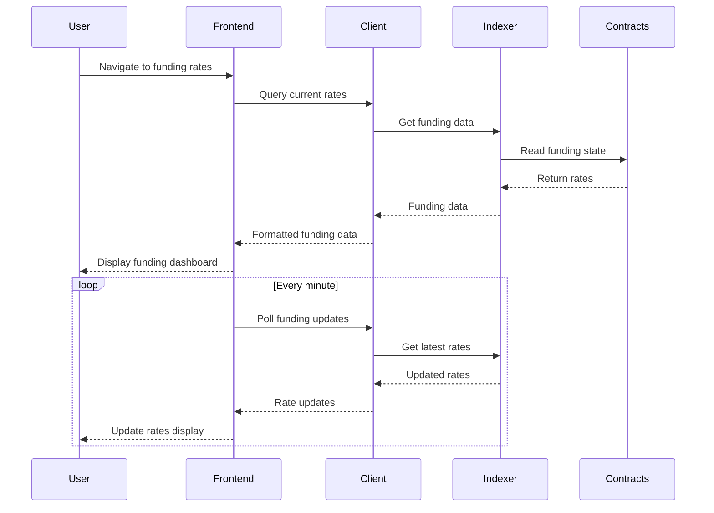

**Task Flow**:
1. Navigate to funding rates section
2. View current funding rates for all markets from Indexer
3. See funding rate history and trends
4. Monitor funding rate predictions
5. Track funding costs for open positions

**Prerequisite Stories**: STAR-109

**Prerequisite Technical Stories**: 
- Funding rate mechanism in contracts
- Funding data processing in indexer

**Acceptance Criteria**:
- **Functional Requirements**:
  - Funding rate dashboard showing all markets with current rates (% per 8 hours)
  - Historical funding chart with 1h, 24h, 7d, 30d views
  - Predicted funding rate based on open interest imbalance
  - Funding payment countdown timer (time until next payment)
  - Cumulative funding received/paid per position
  - Arbitrage opportunity indicator when rates diverge significantly
  - Funding rate heatmap for quick visual analysis
  
- **Non-Functional Requirements**:
  - Funding rate updates every minute
  - Historical data retention for 90 days
  - Predictive model accuracy > 80%
  - Dashboard load time < 2 seconds
  - Mobile-responsive layout
  - Real-time alerts for rate changes > 0.05%

**Unhappy Paths**:
  - Contract read failure uses cached rates
  - Missing historical data shows available range
  - Prediction model failure shows "unavailable"
  - Rate calculation errors trigger fallback formula

**Subtasks**:

- **Frontend Development**
  - Required competencies: React, TypeScript, Charting
  - Area of project modified: Funding Components
  - Details: Rate dashboard, historical charts, prediction display
  
- **Funding Calculations**
  - Required competencies: DeFi Mathematics, Financial Engineering
  - Area of project modified: Funding Service
  - Details: Rate calculation engine, prediction model
  
- **Data Pipeline**
  - Required competencies: Data Engineering, Time-series Analysis
  - Area of project modified: Indexer and Client SDK
  - Details: Funding event processing, aggregation queries
  
- **QA & Testing**
  - Required competencies: Financial Testing, Data Validation
  - Area of project modified: Test Suite

### STAR-115: Provide Liquidity (LP)

**Name**: Provide Liquidity (LP)

**Story**: As a liquidity provider, I want to deposit USDC into the liquidity pool to earn fees from traders while taking proportional house risk through RLP tokens.

**User Flow Diagram**:
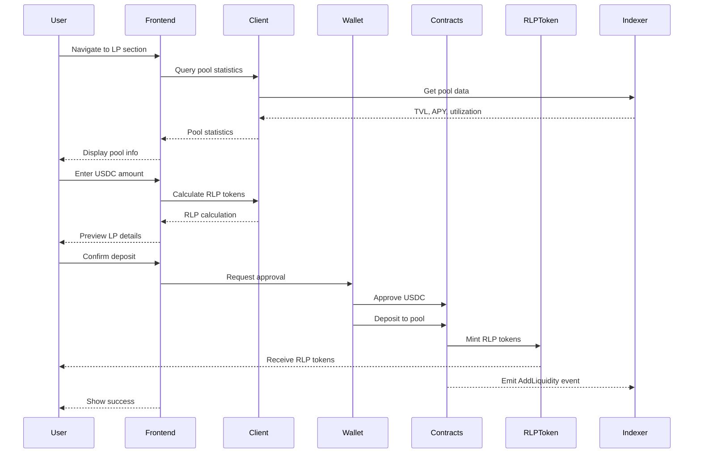

**Task Flow**:
1. Navigate to liquidity provision section
2. View current pool statistics (TVL, APY, utilization) from Indexer
3. Enter USDC amount to deposit
4. Review RLP tokens to be received
5. Review transaction details and fees
6. Submit liquidity deposit transaction
7. Confirm transaction in wallet
8. Receive RLP tokens representing pool share

**Prerequisite Stories**: STAR-112

**Prerequisite Technical Stories**: 
- RLP token system implementation
- Liquidity pool management in contracts

**Acceptance Criteria**:
- **Functional Requirements**:
  - Pool statistics display: TVL, 7-day APY, current utilization, total RLP supply
  - RLP token calculation: deposit_amount / pool_value * total_rlp_supply
  - Minimum deposit: 100 USDC
  - Maximum deposit: 10% of current TVL or $1M (whichever is lower)
  - Deposit fee: 0.1% (configurable)
  - RLP tokens received immediately upon confirmation
  - LP position appears in portfolio with real-time value
  
- **Non-Functional Requirements**:
  - APY calculation updated hourly
  - Pool statistics from Indexer updated every minute
  - Transaction completes within 60 seconds
  - Gas-optimized approval + deposit pattern
  - Comprehensive documentation of risks
  - Integration tests for edge cases

**Unhappy Paths**:
  - Insufficient USDC balance shows required amount
  - Pool capacity reached prevents deposit
  - Approval failure handled gracefully
  - RLP minting failure triggers revert
  - High utilization warning before deposit

**Subtasks**:

- **UI/UX Design**
  - Required competencies: UI/UX Design, DeFi Interfaces
  - Area of project modified: LP Interface
  
- **Frontend Development**
  - Required competencies: React, TypeScript, Web3
  - Area of project modified: LP Components
  - Details: Deposit form, pool statistics, RLP calculator
  
- **Smart Contract Development**
  - Required competencies: Sway/Fuel, DeFi Protocols
  - Area of project modified: Liquidity Pool Contract
  - Details: Deposit function, RLP minting logic
  
- **RLP Token Integration**
  - Required competencies: Token Standards, DeFi
  - Area of project modified: RLP Token Contract
  - Details: Token minting, balance tracking
  
- **QA & Testing**
  - Required competencies: DeFi Testing, Security Testing
  - Area of project modified: Test Suite

### STAR-116: Withdraw Liquidity (LP)

**Name**: Withdraw Liquidity (LP)

**Story**: As a liquidity provider, I want to withdraw my USDC from the liquidity pool when needed by specifying USD amount to withdraw and receiving my proportional share.

**User Flow Diagram**:
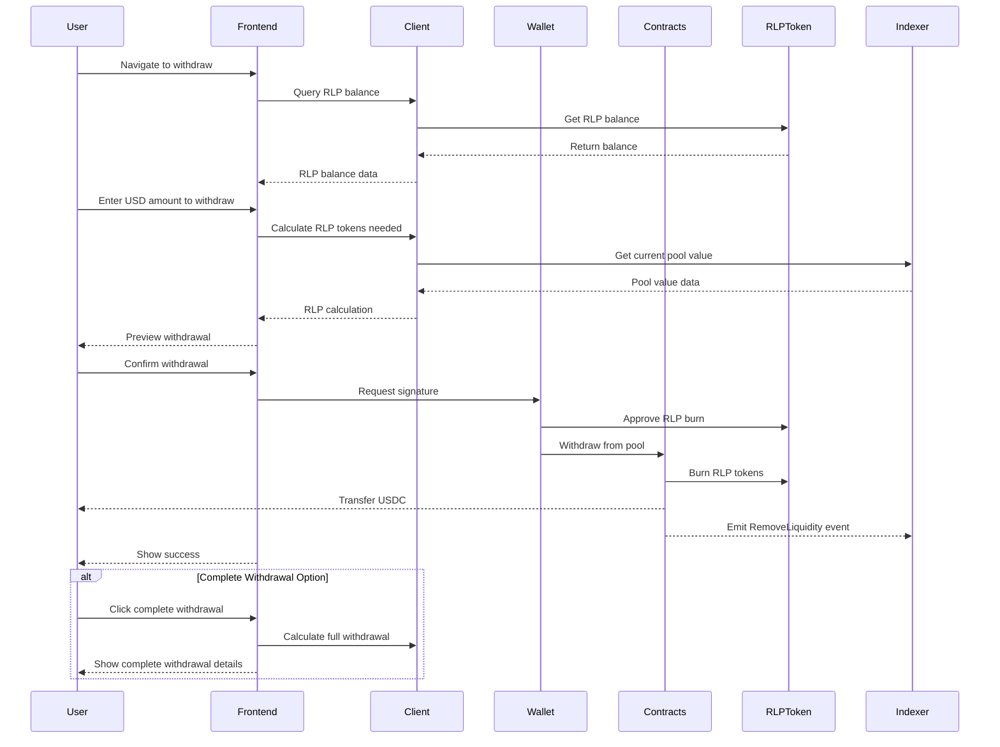

**Task Flow**:
1. Navigate to liquidity withdrawal section
2. View current RLP token balance and USDC value
3. Enter USD amount to withdraw (not RLP tokens)
4. Review RLP tokens to be burned for withdrawal
5. Check for any withdrawal fees or cooldowns
6. Option for complete withdrawal
7. Submit withdrawal transaction
8. Confirm transaction in wallet
9. Receive USDC and see updated RLP balance

**Prerequisite Stories**: STAR-115

**Prerequisite Technical Stories**: 
- RLP token burning mechanism
- Withdrawal logic in contracts

**Acceptance Criteria**:
- **Functional Requirements**:
  - RLP balance display with current USDC value
  - USD amount input for withdrawal (not RLP tokens)
  - RLP calculation: usd_amount / pool_value * total_rlp_supply
  - Complete withdrawal option
  - Partial withdrawal support (minimum $100 or 10%)
  - Withdrawal fee: 0.1% (configurable)
  - 24-hour cooldown period after deposit (configurable)
  - Immediate USDC transfer upon confirmation
  - Updated pool statistics after withdrawal
  
- **Non-Functional Requirements**:
  - Real-time RLP value updates
  - Withdrawal preview accuracy > 99.9%
  - Transaction completes within 60 seconds
  - Clear display of any lockup periods
  - Audit trail of all withdrawals

**Unhappy Paths**:
  - Cooldown period active shows time remaining
  - Insufficient pool liquidity delays withdrawal
  - RLP approval failure handled gracefully
  - Pool imbalance triggers withdrawal limit
  - Emergency withdrawal mode if pool is paused

**Subtasks**:

- **UI/UX Design**
  - Required competencies: UI/UX Design, DeFi Interfaces
  - Area of project modified: LP Interface
  
- **Frontend Development**
  - Required competencies: React, TypeScript, Web3
  - Area of project modified: LP Components
  - Details: USD withdrawal form, complete withdrawal option, cooldown timer, value calculator
  
- **Smart Contract Development**
  - Required competencies: Sway/Fuel, DeFi Protocols
  - Area of project modified: Liquidity Pool Contract
  - Details: USD-based withdrawal function, RLP burning logic, complete withdrawal
  
- **Cooldown Mechanism**
  - Required competencies: Smart Contracts, Time-locks
  - Area of project modified: Pool Contract
  - Details: Cooldown tracking, emergency withdrawal
  
- **QA & Testing**
  - Required competencies: DeFi Testing, Edge Cases
  - Area of project modified: Test Suite

### STAR-117: View LP Performance

**Name**: View LP Performance

**Story**: As a liquidity provider, I want to view my earnings from trading fees and my exposure to trader profits/losses so that I can track my liquidity provision performance.

**User Flow Diagram**:
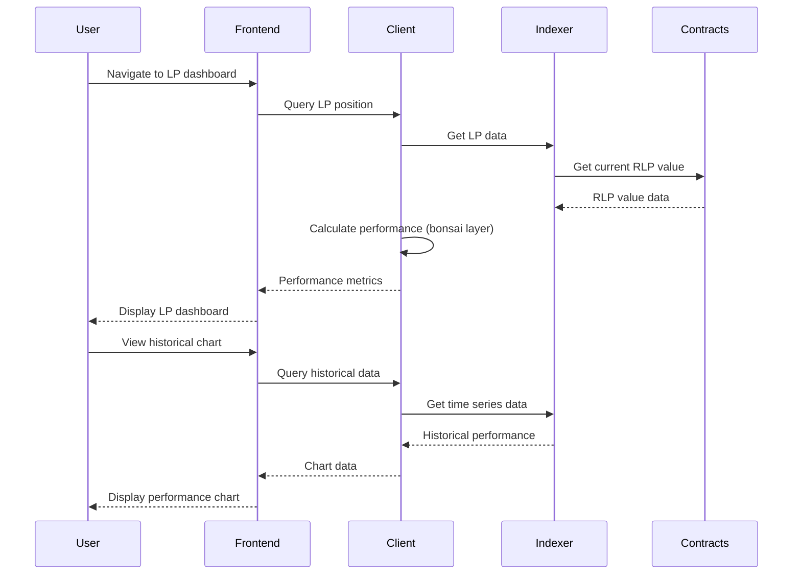

**Task Flow**:
1. Navigate to LP dashboard/analytics
2. View current RLP token value and share of pool
3. See earnings from trading fees over time
4. Monitor exposure to trader PnL
5. Track historical LP performance and returns calculated in Client (bonsai layer)
6. View pool utilization and risk metrics

**Prerequisite Stories**: STAR-115

**Prerequisite Technical Stories**: 
- LP analytics system in Client SDK
- Fee distribution tracking in indexer

**Acceptance Criteria**:
- **Functional Requirements**:
  - Current position: RLP balance, USDC value, pool share %, unrealized P&L
  - Fee earnings breakdown: daily, weekly, monthly, all-time
  - Trader P&L exposure: current exposure, historical impact on returns
  - APY display: 7-day, 30-day, inception-to-date
  - Pool metrics: utilization rate, total fees collected, trader P&L
  - Performance chart with customizable time ranges
  - Risk metrics: max drawdown, volatility, Sharpe ratio
  
- **Non-Functional Requirements**:
  - Dashboard updates every minute
  - Historical data for 1 year
  - Chart renders 10,000+ data points smoothly
  - Mobile-optimized dashboard
  - Real-time fee accrual display

**Unhappy Paths**:
  - No LP position shows demo dashboard
  - Incomplete data shows available range
  - Calculation errors fall back to contract data
  - High trader profits show risk warning

**Subtasks**:

- **UI/UX Design**
  - Required competencies: UI/UX Design, Dashboard Design
  - Area of project modified: LP Dashboard
  
- **Frontend Development**
  - Required competencies: React, TypeScript, Data Visualization
  - Area of project modified: LP Analytics Components
  - Details: Dashboard layout, performance charts, metrics display
  
- **Client SDK Analytics Engine**
  - Required competencies: Financial Analytics, DeFi Metrics, Client SDK
  - Area of project modified: Client SDK Analytics Service
  - Details: APY calculations, risk metrics in bonsai layer, P&L attribution
  
- **Data Pipeline**
  - Required competencies: Data Engineering, Client SDK
  - Area of project modified: Indexer and Client SDK
  - Details: Fee event processing, historical aggregation
  
- **QA & Testing**
  - Required competencies: Analytics Testing, Data Validation
  - Area of project modified: Test Suite

### STAR-118: Handle Transaction Errors

**Name**: Handle Transaction Errors

**Story**: As a trader, I want to receive clear error messages when transactions fail or when I have insufficient collateral so that I can understand and resolve issues quickly.

**User Flow Diagram**:
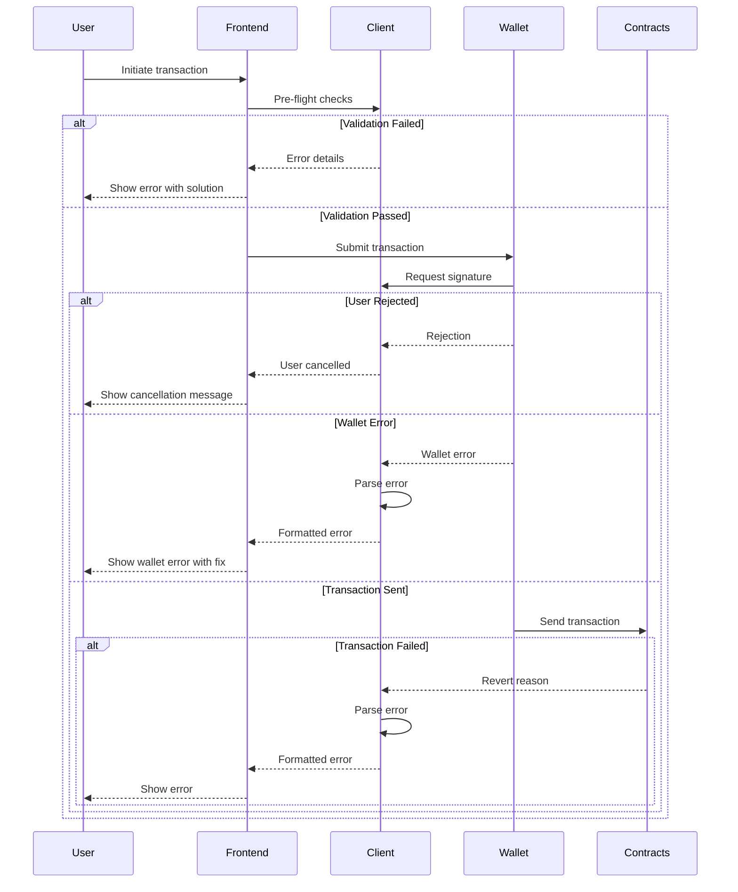

**Task Flow**:
1. Attempt a transaction (deposit, trade, withdrawal)
2. Encounter transaction failure or validation error
3. Receive clear, actionable error message through Client SDK
4. Understand the specific issue (insufficient balance, etc.)
5. Get guidance on how to resolve the problem

**Prerequisite Stories**: STAR-107, STAR-108

**Prerequisite Technical Stories**: 
- Client SDK transaction management system

**Acceptance Criteria**:
- **Functional Requirements**:
  - Pre-flight validation for: insufficient balance, invalid parameters, network issues
  - Error categorization: user errors, network errors, contract errors, wallet errors
  - User-friendly error messages mapping technical errors to plain English
  - Suggested actions for each error type with actionable buttons
  - Error tracking and analytics for monitoring common issues
  - Toast notifications for non-blocking errors
  - Modal dialogs for blocking errors requiring user action
  
- **Non-Functional Requirements**:
  - Error detection within 100ms for validation errors
  - Error message display within 500ms of failure
  - Error logs sent to monitoring service
  - Localization support for error messages
  - Accessibility compliance for error displays

**Unhappy Paths**:
  - Unknown errors show generic message with support link
  - Critical errors trigger emergency mode
  - Network timeout shows offline indicator

**Subtasks**:

- **UX Writing**
  - Required competencies: UX Writing, Technical Communication
  - Area of project modified: Error Messages
  
- **Error Handling System**
  - Required competencies: TypeScript, Error Management, Client SDK
  - Area of project modified: Client SDK Transaction Manager
  - Details: Error parser within Client SDK, recovery flows
  
- **Frontend Components**
  - Required competencies: React, TypeScript, UI Components
  - Area of project modified: Error Components
  - Details: Error modals, toast notifications, inline validation
  
- **Validation Layer**
  - Required competencies: Web3, Validation Logic, Client SDK
  - Area of project modified: Client SDK Validation Service
  - Details: Pre-flight checks, parameter validation
  
- **QA & Testing**
  - Required competencies: Error Testing, E2E Testing
  - Area of project modified: Test Suite
  - Details: Error scenario testing, recovery testing

### STAR-119: View Funding Costs

**Name**: View Funding Costs

**Story**: As a trader, I want to understand the funding fees I'll pay based on my position length and open interest imbalances so that I can factor these costs into my trading decisions.

**User Flow Diagram**:
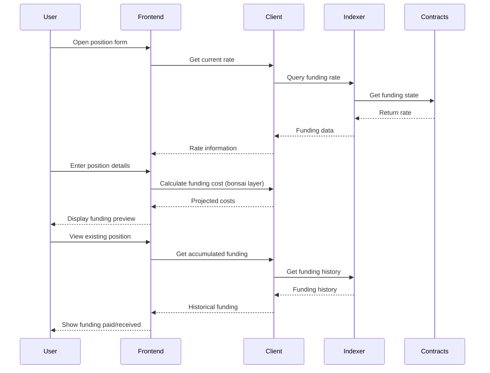

**Task Flow**:
1. View funding rate information before opening position
2. Monitor ongoing funding costs for open positions
3. Understand how funding rates are calculated
4. View funding payment history
5. Factor funding costs into position sizing through Client SDK calculator

**Prerequisite Stories**: STAR-107, STAR-108, STAR-109

**Prerequisite Technical Stories**: 
- Funding rate mechanism

**Acceptance Criteria**:
- **Functional Requirements**:
  - Funding rate display on position entry form (rate per 8 hours)
  - Cost calculator in Client (bonsai layer): position_size * funding_rate * (hours_held / 8)
  - Funding direction indicator (pay/receive based on long/short and rate)
  - Break-even calculator including funding costs
  - Accumulated funding display per position
  - Funding payment history with timestamps and amounts
  - Projected funding costs for 1 day, 7 days, 30 days
  
- **Non-Functional Requirements**:
  - Funding calculations update in real-time
  - Historical funding data for 90 days
  - Calculator accuracy to 6 decimal places
  - Mobile-friendly calculator interface
  - Documentation of funding mechanism

**Unhappy Paths**:
  - Extreme funding rates trigger warning
  - Calculator overflow handled gracefully
  - Missing historical data shows available range
  - Negative rates clearly explained

**Subtasks**:

- **Funding Calculator**
  - Required competencies: React, Financial Mathematics, Client SDK
  - Area of project modified: Client SDK Calculator Components
  - Details: Cost calculator in bonsai layer, break-even analysis, projections
  
- **Frontend Integration**
  - Required competencies: React, TypeScript
  - Area of project modified: Position Components
  - Details: Funding display integration, payment history
  
- **Data Processing**
  - Required competencies: Client SDK, Data Aggregation
  - Area of project modified: Client SDK Layer
  - Details: Funding aggregation queries, history processing
  
- **QA & Testing**
  - Required competencies: Calculator Testing, Math Validation
  - Area of project modified: Test Suite

### STAR-120: Select Network (Testnet/Mainnet)

**Name**: Select Network (Testnet/Mainnet)

**Story**: As a trader, I want to select between testnet and mainnet so that I can test the platform before using it with real funds or switch to the production environment.

**User Flow Diagram**:
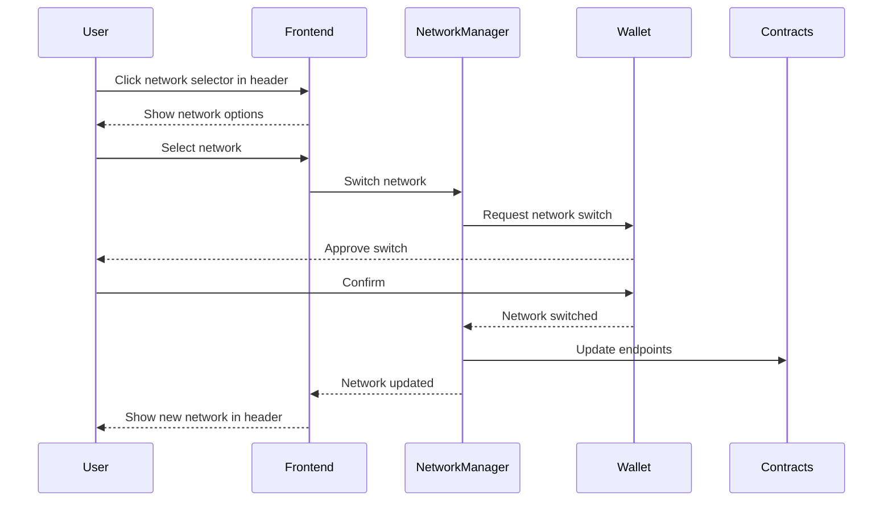

**Task Flow**:
1. Visit Starboard Finance platform
2. See network selector in header
3. Choose between Testnet and Mainnet
4. Confirm network switching
5. See updated network indicator in header
6. Wallet automatically switches to correct network

**Prerequisite Stories**: STAR-112

**Prerequisite Technical Stories**: 
- Multi-network contract deployment
- Network configuration in frontend

**Acceptance Criteria**:
- **Functional Requirements**:
  - Network selector in header showing current network
  - Clear visual distinction: Testnet (orange), Mainnet (green)
  - Network switch updates: contract addresses, RPC endpoints, indexer URLs
  - Wallet network validation and auto-switch prompt
  - Data isolation between networks (no testnet data on mainnet)
  - Network preference saved in localStorage
  - URL parameter support for network selection (?network=testnet)
  
- **Non-Functional Requirements**:
  - Network switch completed within 3 seconds
  - No data loss during network switch
  - Clear warning when switching to mainnet
  - Automatic reconnection after switch
  - Network status monitoring
  - Fallback RPC endpoints for reliability

**Unhappy Paths**:
  - Wallet on wrong network prompts switch
  - Network switch failure maintains current network
  - RPC unavailable shows maintenance message
  - Unsupported network shows error

**Subtasks**:

- **Network Management**
  - Required competencies: Web3, Network Configuration
  - Area of project modified: Network Service
  - Details: Network switching logic, configuration management
  
- **Frontend Integration**
  - Required competencies: React, TypeScript
  - Area of project modified: Header and App Components
  - Details: Network selector in header, visual indicators, state management
  
- **Contract Configuration**
  - Required competencies: Smart Contracts, Multi-chain
  - Area of project modified: Contract Configs
  - Details: Network-specific addresses, ABI management
  
- **QA & Testing**
  - Required competencies: Network Testing, E2E Testing
  - Area of project modified: Test Suite
  - Details: Network switch scenarios, data isolation testing

