# Starboard Finance - Comprehensive Project Story Breakdown

## Table of Contents

### [1. Architecture EPIC](#1-architecture-epic)
- [STAR-140: System Architecture Documentation](#star-140-system-architecture-documentation)
- [STAR-141: Sequence Diagrams for User Flows](#star-141-sequence-diagrams-for-user-flows)
- [STAR-142: Architecture Decision Records](#star-142-architecture-decision-records)
- [STAR-143: Entity Relationship Diagram](#star-143-entity-relationship-diagram)
- [STAR-144: API Specification Documentation](#star-144-api-specification-documentation)
- [STAR-145: Smart Contract ABI Specification](#star-145-smart-contract-abi-specification)
- [STAR-146: Data Flow Diagrams](#star-146-data-flow-diagrams)

### [2. Cloud Infrastructure EPIC](#2-cloud-infrastructure-epic)
- [STAR-147: Database Infrastructure](#star-147-database-infrastructure)
- [STAR-148: Indexer Infrastructure](#star-148-indexer-infrastructure)
- [STAR-149: API Gateway and Load Balancing](#star-149-api-gateway-and-load-balancing)
- [STAR-150: Redis Cache Infrastructure](#star-150-redis-cache-infrastructure)
- [STAR-151: Monitoring and Observability Stack](#star-151-monitoring-and-observability-stack)
- [STAR-152: CI/CD Pipeline Infrastructure](#star-152-cicd-pipeline-infrastructure)
- [STAR-153: Container Orchestration Platform](#star-153-container-orchestration-platform)
- [STAR-154: CDN and Static Asset Hosting](#star-154-cdn-and-static-asset-hosting)
- [STAR-155: Backup and Disaster Recovery](#star-155-backup-and-disaster-recovery)
- [STAR-156: Security Infrastructure](#star-156-security-infrastructure)

### [3. Implementation EPIC](#3-implementation-epic)
- [STAR-106: View Account Balance and Collateral](#star-106-view-account-balance-and-collateral)
- [STAR-107: Open Long Position](#star-107-open-long-position)
- [STAR-108: Open Short Position](#star-108-open-short-position)
- [STAR-109: View Current Positions](#star-109-view-current-positions)
- [STAR-110: Close Positions](#star-110-close-positions)
- [STAR-111: View Market Data and Charts](#star-111-view-market-data-and-charts)
- [STAR-112: Connect Fuel Wallet](#star-112-connect-fuel-wallet)
- [STAR-113: View Trading History](#star-113-view-trading-history)
- [STAR-114: Monitor Funding Rates](#star-114-monitor-funding-rates)
- [STAR-115: Provide Liquidity (LP)](#star-115-provide-liquidity-lp)
- [STAR-116: Withdraw Liquidity (LP)](#star-116-withdraw-liquidity-lp)
- [STAR-117: View LP Performance](#star-117-view-lp-performance)
- [STAR-118: Handle Transaction Errors](#star-118-handle-transaction-errors)
- [STAR-119: View Funding Costs](#star-119-view-funding-costs)
- [STAR-120: Select Network (Testnet/Mainnet)](#star-120-select-network-testnetmainnet)

---

## 1. Architecture EPIC

### STAR-140: System Architecture Documentation

**Name**: System Architecture Documentation

**Story**: As a developer, I want comprehensive system architecture documentation so that I can understand the overall system design and make informed technical decisions.

**Task Flow**:
1. Analyze existing Ruscet architecture and DYDX frontend structure
2. Define Starboard's architectural patterns and principles
3. Document component interactions and data flow
4. Create architectural diagrams and documentation
5. Review with team for completeness and accuracy

**Prerequisite Stories**: None

**Prerequisite Technical Stories**: None

**Subtasks**:
- **Architecture Review** (16 hours)
  - Required competencies: Solution Architecture, Systems Design
  - Area of project modified: Documentation
- **Component Mapping** (12 hours)
  - Required competencies: Frontend Architecture, Smart Contract Architecture
  - Area of project modified: Documentation
- **Documentation Creation** (20 hours)
  - Required competencies: Technical Writing, Architecture Documentation
  - Area of project modified: Documentation

### STAR-141: Sequence Diagrams for User Flows

**Name**: Sequence Diagrams for Key User Flows

**Story**: As a developer, I want sequence diagrams for key user flows so that I can understand the interaction patterns between components during critical operations.

**Task Flow**:
1. Identify critical user flows (trading, LP operations, wallet connection)
2. Map component interactions for each flow
3. Create sequence diagrams using standard notation
4. Document edge cases and error scenarios
5. Review with development team

**Prerequisite Stories**: STAR-140

**Prerequisite Technical Stories**: None

**Subtasks**:
- **Flow Identification** (8 hours)
  - Required competencies: Business Analysis, User Experience
  - Area of project modified: Documentation
- **Sequence Diagram Creation** (24 hours)
  - Required competencies: Systems Design, UML
  - Area of project modified: Documentation
- **Error Flow Documentation** (12 hours)
  - Required competencies: Systems Design, Error Handling
  - Area of project modified: Documentation

### STAR-142: Architecture Decision Records

**Name**: Architecture Decision Records (ADRs)

**Story**: As a developer, I want Architecture Decision Records documenting key technical decisions so that I can understand the rationale behind architectural choices.

**Task Flow**:
1. Identify key architectural decisions made
2. Document context and problem statement for each decision
3. List considered alternatives with pros/cons
4. Record decision and consequences
5. Maintain ADR log for future reference

**Prerequisite Stories**: STAR-140

**Prerequisite Technical Stories**: None

**Subtasks**:
- **ADR Template Creation** (4 hours)
  - Required competencies: Technical Documentation
  - Area of project modified: Documentation
- **Initial ADR Documentation** (20 hours)
  - Required competencies: Architecture, Technical Writing
  - Area of project modified: Documentation
- **Review and Validation** (8 hours)
  - Required competencies: Architecture Review
  - Area of project modified: Documentation

### STAR-143: Entity Relationship Diagram

**Name**: Entity Relationship Diagram

**Story**: As a developer, I want an Entity Relationship Diagram so that I can understand the data model and relationships between entities in the system.

**Task Flow**:
1. Analyze smart contract storage structures
2. Map indexer database schema
3. Document entity relationships and cardinality
4. Create ERD using standard notation
5. Validate with contract and backend developers

**Prerequisite Stories**: STAR-140

**Prerequisite Technical Stories**: None

**Subtasks**:
- **Data Model Analysis** (12 hours)
  - Required competencies: Database Design, Smart Contract Development
  - Area of project modified: Documentation
- **ERD Creation** (8 hours)
  - Required competencies: Data Modeling, ERD Tools
  - Area of project modified: Documentation
- **Schema Documentation** (8 hours)
  - Required competencies: Technical Writing, Database Documentation
  - Area of project modified: Documentation

### STAR-144: API Specification Documentation

**Name**: API Specification Documentation

**Story**: As a developer, I want comprehensive API documentation so that I can understand and integrate with all system endpoints and GraphQL queries.

**Task Flow**:
1. Document GraphQL schema and queries
2. Define REST endpoints if any
3. Specify request/response formats
4. Document authentication and rate limiting
5. Create OpenAPI/GraphQL schema files

**Prerequisite Stories**: STAR-140

**Prerequisite Technical Stories**: None

**Subtasks**:
- **GraphQL Schema Documentation** (16 hours)
  - Required competencies: GraphQL, API Design
  - Area of project modified: Documentation
- **API Testing Documentation** (8 hours)
  - Required competencies: API Testing, Documentation
  - Area of project modified: Documentation
- **Integration Examples** (12 hours)
  - Required competencies: Full Stack Development, Documentation
  - Area of project modified: Documentation

### STAR-145: Smart Contract ABI Specification

**Name**: Smart Contract ABI Specification

**Story**: As a developer, I want detailed smart contract ABI documentation so that I can interact with the contracts correctly and understand their interfaces.

**Task Flow**:
1. Extract ABIs from compiled contracts
2. Document each function's purpose and parameters
3. Specify events and their meanings
4. Document error conditions and revert messages
5. Create integration guide for frontend developers

**Prerequisite Stories**: STAR-140

**Prerequisite Technical Stories**: None

**Subtasks**:
- **ABI Extraction and Documentation** (12 hours)
  - Required competencies: Smart Contract Development, Sway/Solidity
  - Area of project modified: Documentation
- **Event Documentation** (8 hours)
  - Required competencies: Smart Contract Development, Event-Driven Architecture
  - Area of project modified: Documentation
- **Integration Guide Creation** (12 hours)
  - Required competencies: Full Stack Development, Technical Writing
  - Area of project modified: Documentation

### STAR-146: Data Flow Diagrams

**Name**: Data Flow Diagrams

**Story**: As a developer, I want data flow diagrams showing how data moves through the system so that I can understand data transformations and processing pipelines.

**Task Flow**:
1. Map data sources (blockchain, oracles, user input)
2. Document data transformations at each layer
3. Identify data storage points and caching strategies
4. Create data flow diagrams for key processes
5. Document data consistency and synchronization patterns

**Prerequisite Stories**: STAR-140, STAR-143

**Prerequisite Technical Stories**: None

**Subtasks**:
- **Data Pipeline Mapping** (12 hours)
  - Required competencies: Data Architecture, Systems Design
  - Area of project modified: Documentation
- **DFD Creation** (16 hours)
  - Required competencies: Data Modeling, Diagram Tools
  - Area of project modified: Documentation
- **Data Consistency Documentation** (8 hours)
  - Required competencies: Distributed Systems, Data Architecture
  - Area of project modified: Documentation

---

## 2. Cloud Infrastructure EPIC

### STAR-147: Database Infrastructure

**Name**: Database Infrastructure Setup

**Story**: As a dev, I want a PostgreSQL database infrastructure deployed so that the indexer can store and query blockchain event data efficiently.

**Task Flow**:
1. Provision PostgreSQL instances for dev/staging/production
2. Configure replication and high availability
3. Set up connection pooling and optimization
4. Implement backup and recovery procedures
5. Configure monitoring and alerting

**Prerequisite Stories**: None

**Prerequisite Technical Stories**: None

**Acceptance Criteria**:
- **Functional Requirements**:
  - PostgreSQL 14+ deployed with appropriate sizing
  - Read replicas configured for query distribution
  - Connection pooling via PgBouncer or similar
  - Automated backup every 6 hours
- **Non-Functional Requirements**:
  - 99.9% uptime SLA
  - Query response time < 100ms for indexed queries
  - Support for 1000+ concurrent connections
  - Point-in-time recovery capability

**Subtasks**:
- **Database Provisioning** (8 hours)
  - Required competencies: Database Administration, Cloud Infrastructure
  - Area of project modified: Infrastructure
- **High Availability Setup** (12 hours)
  - Required competencies: Database Administration, DevOps
  - Area of project modified: Infrastructure
- **Performance Optimization** (8 hours)
  - Required competencies: Database Optimization, PostgreSQL
  - Area of project modified: Infrastructure

### STAR-148: Indexer Infrastructure

**Name**: Subsquid Indexer Infrastructure

**Story**: As a dev, I want a Subsquid indexer infrastructure deployed so that blockchain events can be processed and made available via GraphQL API.

**Task Flow**:
1. Deploy Subsquid processor nodes
2. Configure event processing pipelines
3. Set up GraphQL gateway
4. Implement auto-scaling policies
5. Configure monitoring and logging

**Prerequisite Stories**: STAR-147

**Prerequisite Technical Stories**: None

**Acceptance Criteria**:
- **Functional Requirements**:
  - Subsquid processor running and syncing with Fuel network
  - GraphQL endpoint accessible with proper authentication
  - Event processing lag < 2 seconds
  - Automatic restart on failure
- **Non-Functional Requirements**:
  - Horizontal scaling based on processing load
  - 99.9% uptime for GraphQL API
  - Comprehensive logging and monitoring
  - Automated deployment via CI/CD

**Subtasks**:
- **Subsquid Deployment** (12 hours)
  - Required competencies: DevOps, Blockchain Infrastructure
  - Area of project modified: Infrastructure
- **GraphQL Gateway Setup** (8 hours)
  - Required competencies: API Infrastructure, GraphQL
  - Area of project modified: Infrastructure
- **Auto-scaling Configuration** (8 hours)
  - Required competencies: Cloud Infrastructure, Kubernetes
  - Area of project modified: Infrastructure

### STAR-149: API Gateway and Load Balancing

**Name**: API Gateway and Load Balancing

**Story**: As a dev, I want an API gateway and load balancer deployed so that API traffic is distributed efficiently and securely across backend services.

**Task Flow**:
1. Deploy API gateway (Kong, AWS API Gateway, etc.)
2. Configure rate limiting and throttling rules
3. Set up load balancing for backend services
4. Implement SSL/TLS termination
5. Configure request routing and transformation

**Prerequisite Stories**: None

**Prerequisite Technical Stories**: None

**Acceptance Criteria**:
- **Functional Requirements**:
  - API gateway routing requests to appropriate services
  - Rate limiting per API key/IP address
  - Load balancing across multiple backend instances
  - SSL/TLS encryption for all endpoints
- **Non-Functional Requirements**:
  - < 10ms added latency from gateway
  - Support for 10,000 requests per second
  - Automatic failover for unhealthy backends
  - API key management and authentication

**Subtasks**:
- **Gateway Deployment** (8 hours)
  - Required competencies: API Infrastructure, DevOps
  - Area of project modified: Infrastructure
- **Security Configuration** (8 hours)
  - Required competencies: Security, API Management
  - Area of project modified: Infrastructure
- **Load Balancer Setup** (6 hours)
  - Required competencies: Network Engineering, Cloud Infrastructure
  - Area of project modified: Infrastructure

### STAR-150: Redis Cache Infrastructure

**Name**: Redis Cache Infrastructure

**Story**: As a dev, I want a Redis cache infrastructure deployed so that frequently accessed data can be served with low latency and reduced database load.

**Task Flow**:
1. Deploy Redis cluster for caching
2. Configure replication and persistence
3. Set up cache invalidation strategies
4. Implement connection pooling
5. Configure monitoring and alerting

**Prerequisite Stories**: None

**Prerequisite Technical Stories**: None

**Acceptance Criteria**:
- **Functional Requirements**:
  - Redis cluster with master-slave replication
  - Automatic failover capability
  - Cache hit ratio > 80% for hot data
  - TTL-based and event-based invalidation
- **Non-Functional Requirements**:
  - < 1ms response time for cache hits
  - Support for 50,000 operations per second
  - Persistence with AOF and RDB snapshots
  - Memory usage monitoring and alerts

**Subtasks**:
- **Redis Cluster Setup** (8 hours)
  - Required competencies: Redis, Cache Infrastructure
  - Area of project modified: Infrastructure
- **Caching Strategy Implementation** (10 hours)
  - Required competencies: Backend Development, Caching
  - Area of project modified: Infrastructure
- **Monitoring Setup** (4 hours)
  - Required competencies: DevOps, Monitoring
  - Area of project modified: Infrastructure

### STAR-151: Monitoring and Observability Stack

**Name**: Monitoring and Observability Stack

**Story**: As a dev, I want a comprehensive monitoring and observability stack deployed so that I can track system health, debug issues, and ensure optimal performance.

**Task Flow**:
1. Deploy metrics collection (Prometheus/DataDog)
2. Set up log aggregation (ELK/CloudWatch)
3. Configure distributed tracing (Jaeger/X-Ray)
4. Create dashboards and visualizations
5. Set up alerting rules and escalation

**Prerequisite Stories**: None

**Prerequisite Technical Stories**: None

**Acceptance Criteria**:
- **Functional Requirements**:
  - Metrics collected from all services
  - Centralized log aggregation and search
  - End-to-end request tracing
  - Custom dashboards for key metrics
- **Non-Functional Requirements**:
  - 1-minute metric resolution
  - 30-day log retention
  - Alert response time < 1 minute
  - Dashboard load time < 3 seconds

**Subtasks**:
- **Metrics Infrastructure** (12 hours)
  - Required competencies: DevOps, Monitoring Tools
  - Area of project modified: Infrastructure
- **Log Aggregation Setup** (10 hours)
  - Required competencies: DevOps, Log Management
  - Area of project modified: Infrastructure
- **Dashboard Creation** (8 hours)
  - Required competencies: Data Visualization, Monitoring
  - Area of project modified: Infrastructure

### STAR-152: CI/CD Pipeline Infrastructure

**Name**: CI/CD Pipeline Infrastructure

**Story**: As a dev, I want a CI/CD pipeline infrastructure so that code changes are automatically tested, built, and deployed to the appropriate environments.

**Task Flow**:
1. Set up GitHub Actions workflows
2. Configure build and test automation
3. Implement deployment pipelines
4. Set up environment promotion
5. Configure rollback mechanisms

**Prerequisite Stories**: None

**Prerequisite Technical Stories**: None

**Acceptance Criteria**:
- **Functional Requirements**:
  - Automated testing on pull requests
  - Build artifacts created and stored
  - Automated deployment to staging
  - Manual approval for production deployment
- **Non-Functional Requirements**:
  - Build time < 10 minutes
  - Zero-downtime deployments
  - Automatic rollback on failure
  - Deployment audit trail

**Subtasks**:
- **Pipeline Setup** (12 hours)
  - Required competencies: DevOps, CI/CD
  - Area of project modified: Infrastructure
- **Test Automation** (10 hours)
  - Required competencies: Test Automation, DevOps
  - Area of project modified: Infrastructure
- **Deployment Automation** (10 hours)
  - Required competencies: DevOps, Cloud Deployment
  - Area of project modified: Infrastructure

### STAR-153: Container Orchestration Platform

**Name**: Container Orchestration Platform

**Story**: As a dev, I want a container orchestration platform deployed so that services can be deployed, scaled, and managed efficiently.

**Task Flow**:
1. Deploy Kubernetes cluster or ECS
2. Configure namespaces and RBAC
3. Set up service mesh (optional)
4. Implement auto-scaling policies
5. Configure resource monitoring

**Prerequisite Stories**: None

**Prerequisite Technical Stories**: None

**Acceptance Criteria**:
- **Functional Requirements**:
  - Container orchestration platform operational
  - Services deployed as containers
  - Automatic scaling based on load
  - Health checks and self-healing
- **Non-Functional Requirements**:
  - 99.95% platform availability
  - Scale from 2 to 100 pods in < 2 minutes
  - Resource utilization > 70%
  - Network policies enforced

**Subtasks**:
- **Kubernetes Setup** (16 hours)
  - Required competencies: Kubernetes, Container Orchestration
  - Area of project modified: Infrastructure
- **Service Configuration** (12 hours)
  - Required competencies: DevOps, Microservices
  - Area of project modified: Infrastructure
- **Security Hardening** (8 hours)
  - Required competencies: Security, Kubernetes
  - Area of project modified: Infrastructure

### STAR-154: CDN and Static Asset Hosting

**Name**: CDN and Static Asset Hosting

**Story**: As a dev, I want a CDN and static asset hosting solution so that frontend assets are delivered quickly to users globally.

**Task Flow**:
1. Configure CDN (CloudFlare/CloudFront)
2. Set up origin servers
3. Configure caching policies
4. Implement cache invalidation
5. Set up monitoring and analytics

**Prerequisite Stories**: None

**Prerequisite Technical Stories**: None

**Acceptance Criteria**:
- **Functional Requirements**:
  - CDN configured for all static assets
  - Automatic cache invalidation on deployment
  - HTTPS enforcement
  - Image optimization and compression
- **Non-Functional Requirements**:
  - Global latency < 100ms
  - 99.99% CDN availability
  - Bandwidth cost optimization
  - DDoS protection enabled

**Subtasks**:
- **CDN Configuration** (6 hours)
  - Required competencies: CDN, Web Performance
  - Area of project modified: Infrastructure
- **Origin Setup** (4 hours)
  - Required competencies: DevOps, Web Infrastructure
  - Area of project modified: Infrastructure
- **Performance Optimization** (6 hours)
  - Required competencies: Web Performance, Frontend
  - Area of project modified: Infrastructure

### STAR-155: Backup and Disaster Recovery

**Name**: Backup and Disaster Recovery

**Story**: As a dev, I want backup and disaster recovery procedures so that the system can be restored quickly in case of data loss or system failure.

**Task Flow**:
1. Implement automated backup procedures
2. Configure cross-region replication
3. Create disaster recovery runbooks
4. Set up recovery testing schedule
5. Implement monitoring and alerting

**Prerequisite Stories**: STAR-147

**Prerequisite Technical Stories**: None

**Acceptance Criteria**:
- **Functional Requirements**:
  - Daily automated backups of all critical data
  - Cross-region backup replication
  - Documented recovery procedures
  - Regular recovery drills
- **Non-Functional Requirements**:
  - RPO (Recovery Point Objective) < 1 hour
  - RTO (Recovery Time Objective) < 4 hours
  - Backup retention for 30 days
  - Encrypted backups at rest and in transit

**Subtasks**:
- **Backup Implementation** (10 hours)
  - Required competencies: DevOps, Backup Solutions
  - Area of project modified: Infrastructure
- **DR Documentation** (8 hours)
  - Required competencies: DevOps, Documentation
  - Area of project modified: Infrastructure
- **Recovery Testing** (6 hours)
  - Required competencies: DevOps, System Administration
  - Area of project modified: Infrastructure

### STAR-156: Security Infrastructure

**Name**: Security Infrastructure

**Story**: As a dev, I want comprehensive security infrastructure so that the platform is protected against common attacks and vulnerabilities.

**Task Flow**:
1. Deploy WAF (Web Application Firewall)
2. Configure DDoS protection
3. Implement secrets management
4. Set up security scanning
5. Configure audit logging

**Prerequisite Stories**: None

**Prerequisite Technical Stories**: None

**Acceptance Criteria**:
- **Functional Requirements**:
  - WAF protecting all public endpoints
  - DDoS mitigation active
  - Secrets stored in vault (HashiCorp Vault/AWS Secrets Manager)
  - Vulnerability scanning on deployments
- **Non-Functional Requirements**:
  - Block OWASP Top 10 attacks
  - < 5 minute DDoS mitigation time
  - Audit logs retained for 1 year
  - Security alerts < 1 minute

**Subtasks**:
- **WAF Configuration** (8 hours)
  - Required competencies: Security, Web Security
  - Area of project modified: Infrastructure
- **Secrets Management** (8 hours)
  - Required competencies: Security, DevOps
  - Area of project modified: Infrastructure
- **Security Monitoring** (8 hours)
  - Required competencies: Security, SIEM
  - Area of project modified: Infrastructure

---

## 3. Implementation EPIC

### STAR-106: View Account Balance and Collateral

**Name**: View Account Balance and Collateral

**Story**: As a trader, I want to view the current balance of my account so that I can understand my available collateral and make informed trading decisions.

**User Flow Diagram**:
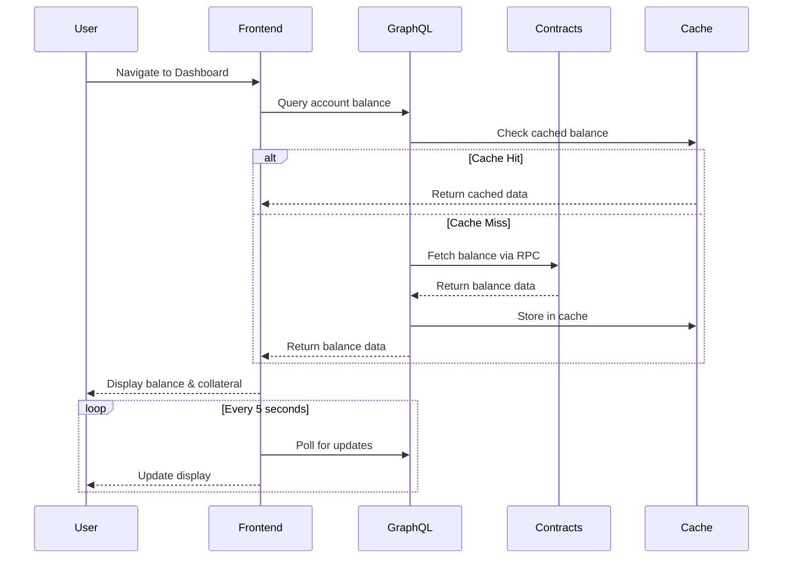

**Task Flow**:
1. Navigate to account/portfolio section
2. View total USDC balance
3. See available collateral for new positions
4. View used collateral in existing positions
5. Check margin utilization percentage
6. Monitor balance updates via polling

**Prerequisite Stories**: STAR-112

**Prerequisite Technical Stories**: 
- Frontend scaffolding and wallet integration
- GraphQL API setup with data transformation
- Indexer configuration for balance tracking

**Acceptance Criteria**:
- **Functional Requirements**:
  - Dashboard displays total USDC balance with 6 decimal precision
  - Available collateral calculation: total_balance - used_collateral - pending_orders
  - Used collateral breakdown shows allocation per position with percentages
  - Margin utilization = (used_collateral / total_balance) * 100
  - Balance updates within 5 seconds of on-chain changes via polling
  - Color-coded margin health: green (0-50%), yellow (50-80%), red (80-100%)
  
- **Non-Functional Requirements**:
  - Page load time < 2 seconds
  - Balance query response time < 500ms
  - Polling doesn't cause memory leaks after 24 hours
  - Graceful handling of RPC failures with cached data fallback
  - Unit tests with 90% coverage
  - Integration tests for balance calculations
  - Documented balance calculation formulas

**Unhappy Paths**:
  - Network disconnection shows last known balance with "offline" indicator
  - Contract query failure displays cached balance with timestamp
  - Invalid balance data triggers error boundary with recovery option
  - Negative balance prevention with validation checks

**Subtasks**:

- **UI/UX Design** (8 hours)
  - Required competencies: UI/UX Design, Financial Interfaces
  - Area of project modified: Design System
  
- **Frontend Implementation** (20 hours)
  - Required competencies: React, TypeScript, GraphQL Client
  - Area of project modified: Frontend Dashboard Component
  - Details: Implement balance display component with polling, integrate with wallet connector (STAR-122 subtask), create margin utilization visualizations
  
- **GraphQL Integration** (12 hours)
  - Required competencies: GraphQL, Backend Development
  - Area of project modified: GraphQL Schema and Resolvers
  - Details: Create balance queries, implement caching layer, optimize polling endpoints
  
- **Smart Contract Integration** (8 hours)
  - Required competencies: Sway/Fuel, Contract Integration
  - Area of project modified: Contract Interfaces
  - Details: Integrate balance query functions, handle multiple collateral types
  
- **Testing & QA** (12 hours)
  - Required competencies: Test Automation, E2E Testing
  - Area of project modified: Test Suite
  - Details: Unit tests for calculations, integration tests for data flow, E2E tests for user journey

### STAR-107: Open Long Position

**Name**: Open Long Position

**Story**: As a trader, I want to open long positions on crypto assets (ETH, BTC, FUEL, stFUEL) with leverage so that I can amplify my gains on price increases.

**User Flow Diagram**:
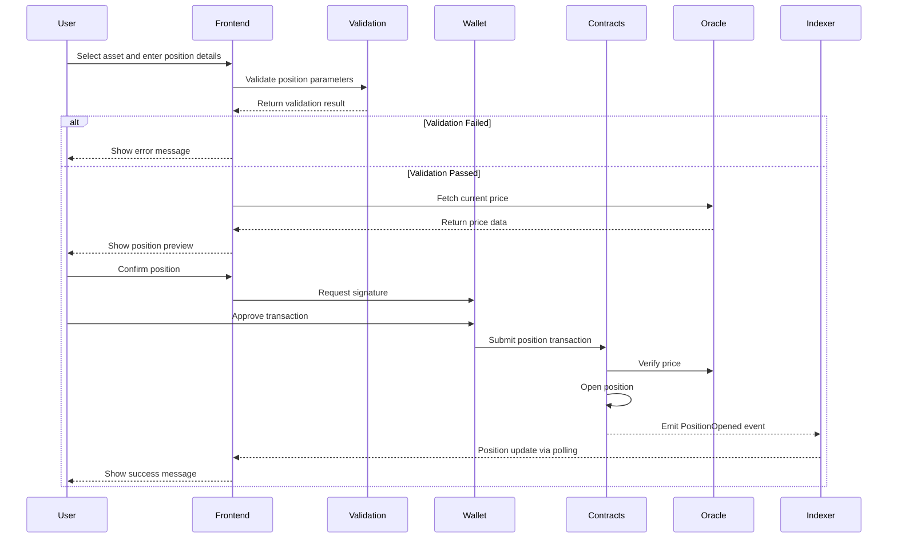

**Task Flow**:
1. Navigate to trading interface for desired asset
2. Select "Long" position side
3. Enter position size in USD
4. Set leverage multiplier (subject to limits)
5. Review position details (collateral required, liquidation price)
6. Submit position order
7. Confirm transaction in wallet
8. Wait for position to open

**Prerequisite Stories**: STAR-106, STAR-112

**Prerequisite Technical Stories**: 
- Contract position management implementation (STAR-129)
- Oracle integration for price feeds (STAR-133)
- Trading interface development (STAR-123)
- Transaction management system (STAR-124)

**Acceptance Criteria**:
- **Functional Requirements**:
  - Support for ETH, BTC, FUEL, stFUEL with correct decimal precision
  - Position size validation: min $10, max $1,000,000
  - Leverage limits: 2x-20x for BTC/ETH, 2x-10x for FUEL/stFUEL
  - Real-time liquidation price calculation: entry_price * (1 - 1/leverage + fees)
  - Slippage tolerance setting: 0.1%, 0.5%, 1%, custom
  - Transaction completes within 60 seconds or times out with rollback
  - Position appears in portfolio immediately after confirmation
  
- **Non-Functional Requirements**:
  - Price updates every 1 second during position entry
  - Gas estimation accurate within 10%
  - Transaction retry logic for temporary failures
  - Comprehensive audit trail of position parameters
  - Unit tests for leverage calculations
  - Integration tests for position lifecycle
  - Load testing for 100 concurrent position openings

**Unhappy Paths**:
  - Insufficient collateral shows required amount and deposit option
  - Price movement beyond slippage reverts with explanation
  - Oracle failure prevents position with safety message
  - Network congestion warning with gas price options
  - Contract paused state shows maintenance message

**Subtasks**:

- **UI/UX Design** (12 hours)
  - Required competencies: UI/UX Design, Trading Interfaces
  - Area of project modified: Trading Interface Design
  
- **Frontend Development** (24 hours)
  - Required competencies: React, TypeScript, Web3 Integration
  - Area of project modified: Trading Interface Components
  - Details: Position entry form, leverage slider, preview modal, real-time price updates, integration with charts (STAR-126 subtask)
  
- **Smart Contract Development** (32 hours)
  - Required competencies: Sway/Fuel, DeFi Protocols, Financial Mathematics
  - Area of project modified: Position Manager Contract
  - Details: Implement increase_position function (STAR-129 subtask), margin calculations, leverage validation, slippage protection
  
- **Oracle Integration** (16 hours)
  - Required competencies: Blockchain Oracles, Price Feeds
  - Area of project modified: Oracle Interface
  - Details: Integrate Stork oracle feeds (STAR-133 subtask), price validation, staleness checks
  
- **Backend Processing** (16 hours)
  - Required competencies: Node.js, GraphQL, Event Processing
  - Area of project modified: Backend Services
  - Details: Position event processing, state management, analytics tracking (STAR-127 subtask)
  
- **QA & Testing** (16 hours)
  - Required competencies: DeFi Testing, Smart Contract Auditing
  - Area of project modified: Test Suite
  - Details: Leverage edge cases, liquidation scenarios, oracle manipulation tests

### STAR-108: Open Short Position

**Name**: Open Short Position

**Story**: As a trader, I want to open short positions on crypto assets (ETH, BTC, FUEL, stFUEL) with leverage so that I can profit from price decreases.

**User Flow Diagram**:
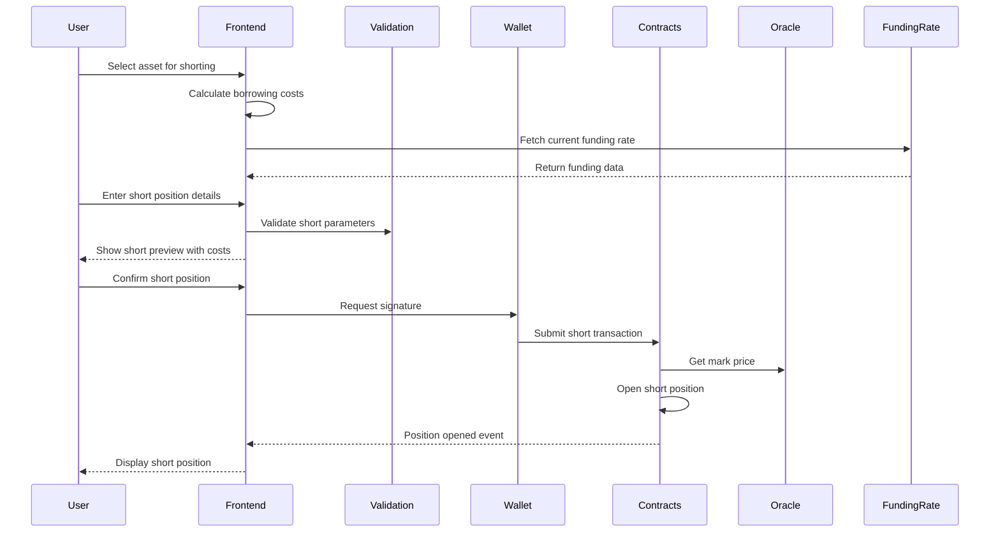

**Task Flow**:
1. Navigate to trading interface for desired asset
2. Select "Short" position side
3. Enter position size in USD
4. Set leverage multiplier (subject to limits)
5. Review position details (collateral required, liquidation price)
6. Submit position order
7. Confirm transaction in wallet
8. Wait for position to open

**Prerequisite Stories**: STAR-106, STAR-112

**Prerequisite Technical Stories**: 
- Contract position management (STAR-129)
- Funding rate mechanism (STAR-130)
- Oracle integration (STAR-133)

**Acceptance Criteria**:
- **Functional Requirements**:
  - Short position interface with same assets as long positions
  - Borrowing cost display: funding_rate * position_size * duration
  - Short liquidation price: entry_price * (1 + 1/leverage - fees)
  - Funding rate display with 8-hour payment cycles
  - Maximum short interest limits per asset
  - Short positions marked distinctly in portfolio (red indicators)
  
- **Non-Functional Requirements**:
  - Funding rate updates every minute
  - Short interest calculations cached for performance
  - Accurate P&L calculations including funding costs
  - Stress testing for extreme market conditions
  - Documentation of short position mechanics
  - Integration tests for funding payments

**Unhappy Paths**:
  - Maximum short interest reached shows current limit
  - Negative funding rate clearly explained to user
  - Insufficient liquidity for short prevents position
  - Funding payment failure triggers liquidation warning

**Subtasks**:

- **UI/UX Design** (8 hours)
  - Required competencies: UI/UX Design, Financial Interfaces
  - Area of project modified: Trading Interface
  
- **Frontend Development** (20 hours)
  - Required competencies: React, TypeScript, DeFi Interfaces
  - Area of project modified: Trading Components
  - Details: Short position form, funding rate display, cost calculator
  
- **Smart Contract Development** (28 hours)
  - Required competencies: Sway/Fuel, DeFi Mathematics
  - Area of project modified: Position Manager Contract
  - Details: Short position logic, funding rate integration (STAR-130 subtask), borrowing mechanics
  
- **Funding Rate Integration** (16 hours)
  - Required competencies: DeFi Protocols, Financial Engineering
  - Area of project modified: Funding System
  - Details: Implement funding rate calculations (STAR-130 subtask), payment collection
  
- **QA & Testing** (12 hours)
  - Required competencies: DeFi Testing, Risk Analysis
  - Area of project modified: Test Suite
  - Details: Short squeeze scenarios, funding payment edge cases

### STAR-109: View Current Positions

**Name**: View Current Positions

**Story**: As a trader, I want to view my current positions, including size, leverage, PnL, and margin requirements so that I can monitor my portfolio performance and risk.

**User Flow Diagram**:
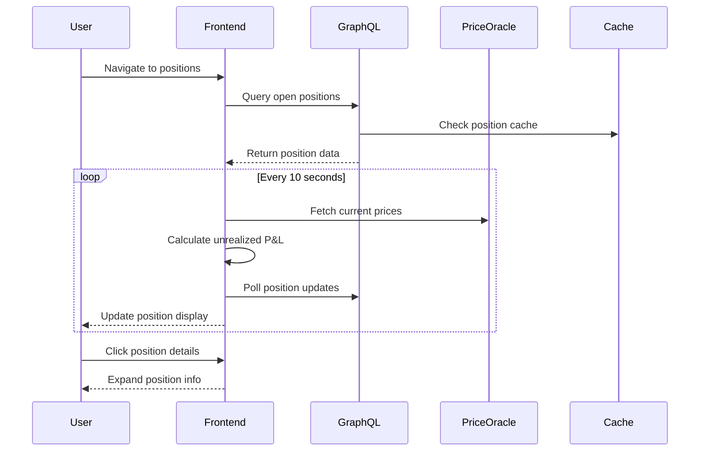

**Task Flow**:
1. Navigate to portfolio/positions section
2. View list of all open positions
3. See position details: asset, side, size, leverage
4. Monitor PnL via periodic polling (realized and unrealized)
5. Check margin requirements and liquidation prices
6. View position history and performance metrics

**Prerequisite Stories**: STAR-107, STAR-108

**Prerequisite Technical Stories**: 
- GraphQL position data processing
- Real-time P&L calculation system with polling

**Acceptance Criteria**:
- **Functional Requirements**:
  - Position table with sortable columns: Asset, Side, Size, Leverage, Entry Price, Mark Price, P&L, ROE
  - Unrealized P&L: (mark_price - entry_price) * size * side_multiplier
  - ROE (Return on Equity): unrealized_pnl / initial_margin * 100
  - Margin ratio with visual indicators: safe (>50%), warning (20-50%), danger (<20%)
  - Expandable rows showing: entry time, funding paid/received, fees paid, liquidation price
  - Position grouping by asset with aggregate statistics
  
- **Non-Functional Requirements**:
  - Position updates every 10 seconds via polling
  - P&L calculations accurate to 6 decimal places
  - Table renders 100+ positions without lag
  - Export functionality for position data (CSV)
  - Mobile-responsive table design
  - Real-time price feeds integrated

**Unhappy Paths**:
  - Price feed failure shows last known prices with timestamp
  - Large position count triggers pagination
  - Calculation errors show fallback to contract data
  - Network issues maintain local state with sync indicator

**Subtasks**:

- **UI/UX Design** (10 hours)
  - Required competencies: UI/UX Design, Data Visualization
  - Area of project modified: Portfolio Interface
  
- **Frontend Implementation** (20 hours)
  - Required competencies: React, TypeScript, Table Components
  - Area of project modified: Portfolio Components
  - Details: Position table, P&L calculations, real-time updates via polling (STAR-125 subtask)
  
- **Backend Integration** (16 hours)
  - Required competencies: GraphQL, Real-time Data
  - Area of project modified: GraphQL Resolvers
  - Details: Position aggregation, P&L calculations, performance metrics (STAR-127 subtask)
  
- **Data Processing** (12 hours)
  - Required competencies: Data Engineering, Event Processing
  - Area of project modified: Indexer
  - Details: Position event processing (STAR-135 subtask), state reconstruction
  
- **QA & Testing** (8 hours)
  - Required competencies: Frontend Testing, Data Validation
  - Area of project modified: Test Suite

### STAR-110: Close Positions

**Name**: Close Positions

**Story**: As a trader, I want to close my positions partially or fully to realize profits or cut losses and manage my portfolio risk.

**User Flow Diagram**:
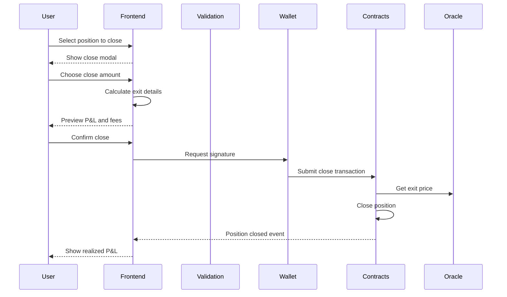

**Task Flow**:
1. Navigate to open position
2. Select "Close Position" action
3. Choose close amount (partial or full)
4. Review closing details (exit price, fees, final PnL)
5. Submit close position transaction
6. Confirm transaction in wallet
7. Wait for position closure

**Prerequisite Stories**: STAR-109

**Prerequisite Technical Stories**: 
- Position closure functionality in contracts (STAR-129)
- Transaction management system (STAR-124)

**Acceptance Criteria**:
- **Functional Requirements**:
  - Close modal with slider for partial close (25%, 50%, 75%, 100%, custom)
  - Exit price estimation including slippage impact
  - Fee breakdown: trading fee, funding fee (if any), network fee
  - Final P&L calculation: (exit_price - entry_price) * size - total_fees
  - Position closure confirmation within 60 seconds
  - Portfolio automatically updates after closure
  - Transaction history entry created with all details
  
- **Non-Functional Requirements**:
  - Closure transaction gas optimization
  - Partial close minimum: $10 or 10% (whichever is greater)
  - Success rate monitoring for closures
  - Automated testing for partial close scenarios
  - Documentation of closure mechanics

**Unhappy Paths**:
  - Insufficient gas shows required amount
  - Price movement beyond slippage shows requote option
  - Contract pause prevents closure with explanation
  - Partial close leaving dust amount prevented
  - Failed transaction triggers automatic retry

**Subtasks**:

- **UI/UX Design** (6 hours)
  - Required competencies: UI/UX Design, Modal Design
  - Area of project modified: Trading Interface
  
- **Frontend Development** (16 hours)
  - Required competencies: React, TypeScript, Transaction UI
  - Area of project modified: Position Management Components
  - Details: Close modal, partial close slider, P&L preview
  
- **Smart Contract Development** (20 hours)
  - Required competencies: Sway/Fuel, DeFi Protocols
  - Area of project modified: Position Manager Contract
  - Details: Implement decrease_position function (STAR-129 subtask), partial close logic
  
- **Transaction Processing** (12 hours)
  - Required competencies: Web3, Transaction Management
  - Area of project modified: Transaction System
  - Details: Transaction management integration (STAR-124 subtask), retry logic
  
- **QA & Testing** (10 hours)
  - Required competencies: DeFi Testing, Transaction Testing
  - Area of project modified: Test Suite

### STAR-111: View Market Data and Charts

**Name**: View Market Data and Charts

**Story**: As a trader, I want to view price charts and market data (updated via polling) for the assets I'm trading so that I can make informed trading decisions.

**User Flow Diagram**:
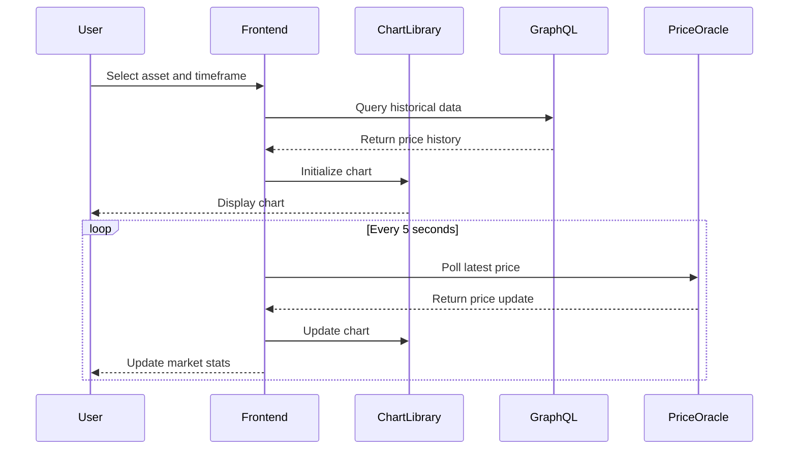

**Task Flow**:
1. Navigate to trading interface for specific asset
2. View price chart with different timeframes (updated via polling)
3. See current bid/ask prices and spread
4. Monitor 24h volume and price change
5. Access technical indicators and drawing tools

**Prerequisite Stories**: None

**Prerequisite Technical Stories**: 
- Oracle integration (STAR-133)
- Charts infrastructure setup (STAR-126)

**Acceptance Criteria**:
- **Functional Requirements**:
  - TradingView Advanced Charts integration
  - Timeframes: 1m, 5m, 15m, 30m, 1h, 4h, 1d, 1w
  - Market stats: 24h volume, high, low, price change %, open interest
  - Technical indicators: MA, EMA, RSI, MACD, Bollinger Bands (minimum)
  - Drawing tools: trendlines, horizontal lines, fibonacci
  - Price updates every 5 seconds via polling
  - Chart data persistence in localStorage
  
- **Non-Functional Requirements**:
  - Chart load time < 2 seconds
  - Smooth chart performance with 10,000+ candles
  - Mobile-responsive chart interface
  - Offline chart viewing with cached data
  - WebSocket fallback to polling if needed
  - Chart library bundle size < 500KB

**Unhappy Paths**:
  - Missing historical data shows available range
  - Price feed interruption maintains last known state
  - Chart library load failure shows basic price display
  - Invalid timeframe selection defaults to 1h

**Subtasks**:

- **UI/UX Design** (8 hours)
  - Required competencies: UI/UX Design, Financial Charts
  - Area of project modified: Trading Interface
  
- **Frontend Implementation** (24 hours)
  - Required competencies: React, TradingView, TypeScript
  - Area of project modified: Chart Components
  - Details: TradingView integration (STAR-126 subtask), custom indicators, toolbar
  
- **Data Pipeline** (16 hours)
  - Required competencies: Data Engineering, Time-series Data
  - Area of project modified: Backend Services
  - Details: OHLCV data aggregation, historical data storage, polling infrastructure (STAR-137 subtask)
  
- **Price Feed Integration** (12 hours)
  - Required competencies: Real-time Data, GraphQL
  - Area of project modified: GraphQL Layer
  - Details: Real-time price subscription, data transformation (STAR-136 subtask)
  
- **QA & Testing** (8 hours)
  - Required competencies: Frontend Testing, Performance Testing
  - Area of project modified: Test Suite

### STAR-112: Connect Fuel Wallet

**Name**: Connect Fuel Wallet

**Story**: As a trader, I want to connect my Fuel wallet to the platform to manage my trades and interact with the Fuel network securely.

**User Flow Diagram**:
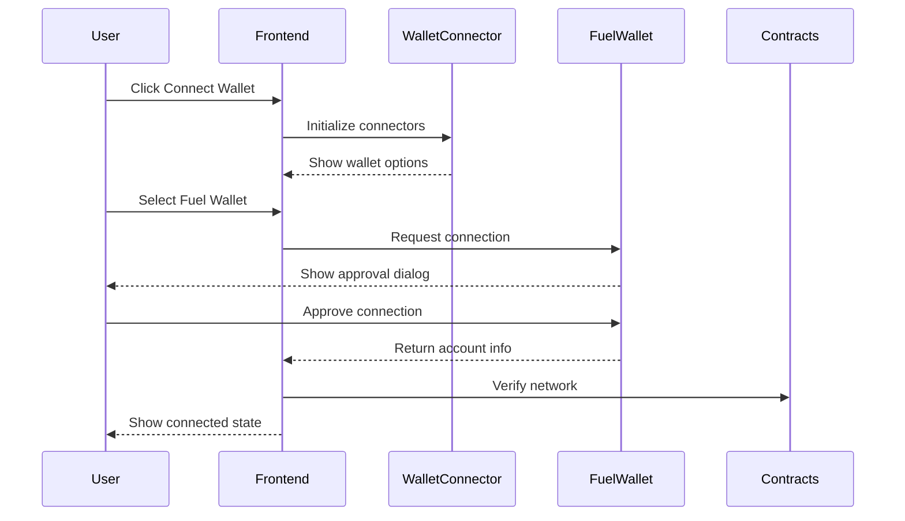

**Task Flow**:
1. Visit Starboard Finance platform
2. Click "Connect Wallet" button
3. Select Fuel wallet from connector options
4. Authorize connection in wallet app
5. Confirm account selection

**Prerequisite Stories**: None

**Prerequisite Technical Stories**: 
- Frontend project setup (STAR-121)

**Acceptance Criteria**:
- **Functional Requirements**:
  - Support for Fuel Wallet, WalletConnect compatible wallets
  - Account address displayed in truncated format (0x1234...5678)
  - Network validation ensuring correct chain (testnet/mainnet)
  - Multi-account support with easy switching
  - Disconnect functionality clearing all session data
  - Auto-reconnect on page refresh if previously connected
  - Connection state persisted in localStorage
  
- **Non-Functional Requirements**:
  - Connection process < 5 seconds
  - Secure storage of connection metadata
  - No private keys stored in browser
  - Graceful handling of wallet rejection
  - Mobile wallet support via deep linking
  - Browser extension detection

**Unhappy Paths**:
  - No wallet installed shows installation guide
  - Wrong network prompts network switch
  - Connection timeout after 30 seconds
  - Wallet locked requires unlock prompt
  - Multiple wallets shows selection modal

**Subtasks**:

- **UI/UX Design** (4 hours)
  - Required competencies: UI/UX Design, Web3 UX
  - Area of project modified: Header Component
  
- **Wallet Integration** (16 hours)
  - Required competencies: Web3, Fuel SDK, TypeScript
  - Area of project modified: Wallet Service
  - Details: Fuel connector setup (STAR-122 subtask), wallet state management, connection persistence
  
- **Frontend Components** (12 hours)
  - Required competencies: React, TypeScript
  - Area of project modified: Header and Auth Components
  - Details: Connection modal, account display, network indicator
  
- **Network Validation** (6 hours)
  - Required competencies: Blockchain, Network Management
  - Area of project modified: Network Service
  - Details: Chain ID validation, network switching logic
  
- **QA & Testing** (8 hours)
  - Required competencies: Web3 Testing, E2E Testing
  - Area of project modified: Test Suite

### STAR-113: View Trading History

**Name**: View Trading History

**Story**: As a trader, I want to see my trading history and performance metrics so that I can analyze my trading patterns and improve my strategy.

**User Flow Diagram**:
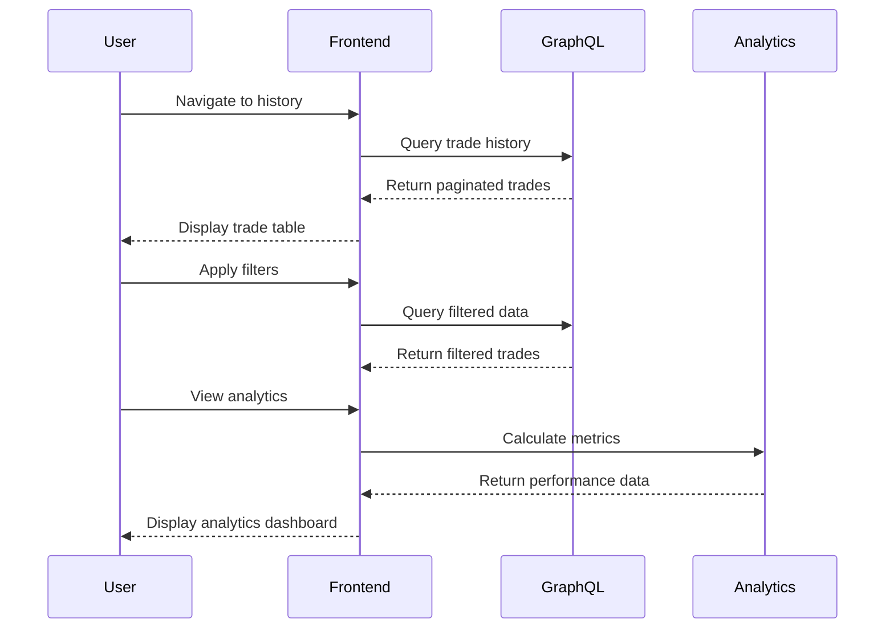

**Task Flow**:
1. Navigate to account/history section
2. View chronological list of all trades
3. Filter by date range, asset, or trade type
4. See trade details: price, size, fees, PnL
5. View aggregate performance statistics
6. Export trading data (optional)

**Prerequisite Stories**: STAR-107, STAR-108, STAR-110

**Prerequisite Technical Stories**: 
- Trade history processing in indexer
- Analytics system setup (STAR-127)

**Acceptance Criteria**:
- **Functional Requirements**:
  - Trade history table: Date, Asset, Side, Size, Entry/Exit Price, Fees, P&L, ROE
  - Filters: date range picker, asset selector, long/short filter, profit/loss filter
  - Pagination with 25, 50, 100 items per page
  - Trade details modal with complete transaction information
  - Performance metrics: Total P&L, Win Rate, Average Win/Loss, Sharpe Ratio, Max Drawdown
  - CSV export with all trade data and calculations
  - Cumulative P&L chart over time
  
- **Non-Functional Requirements**:
  - Query response time < 1 second for 1000 trades
  - Real-time updates for new trades
  - Data retention for 1 year minimum
  - Mobile-optimized table view
  - Audit trail for all modifications
  - GDPR-compliant data export

**Unhappy Paths**:
  - No trades shows onboarding message
  - Large date ranges trigger pagination warning
  - Export failure provides retry option
  - Missing price data shows estimation notice

**Subtasks**:

- **UI/UX Design** (8 hours)
  - Required competencies: UI/UX Design, Data Tables
  - Area of project modified: History Interface
  
- **Frontend Development** (20 hours)
  - Required competencies: React, TypeScript, Data Visualization
  - Area of project modified: History Components
  - Details: Trade table, filters, export functionality, performance charts
  
- **Analytics Engine** (16 hours)
  - Required competencies: Financial Analytics, Statistics
  - Area of project modified: Analytics Service
  - Details: Performance metrics calculation (STAR-127 subtask), risk metrics
  
- **Data Processing** (12 hours)
  - Required competencies: GraphQL, Database Optimization
  - Area of project modified: GraphQL Layer
  - Details: Trade aggregation queries, pagination optimization
  
- **QA & Testing** (8 hours)
  - Required competencies: Data Testing, Performance Testing
  - Area of project modified: Test Suite

### STAR-114: Monitor Funding Rates

**Name**: Monitor Funding Rates

**Story**: As a funding rate arbitrager, I want to monitor funding rates across different time periods to identify arbitrage opportunities and optimize my positions.

**User Flow Diagram**:
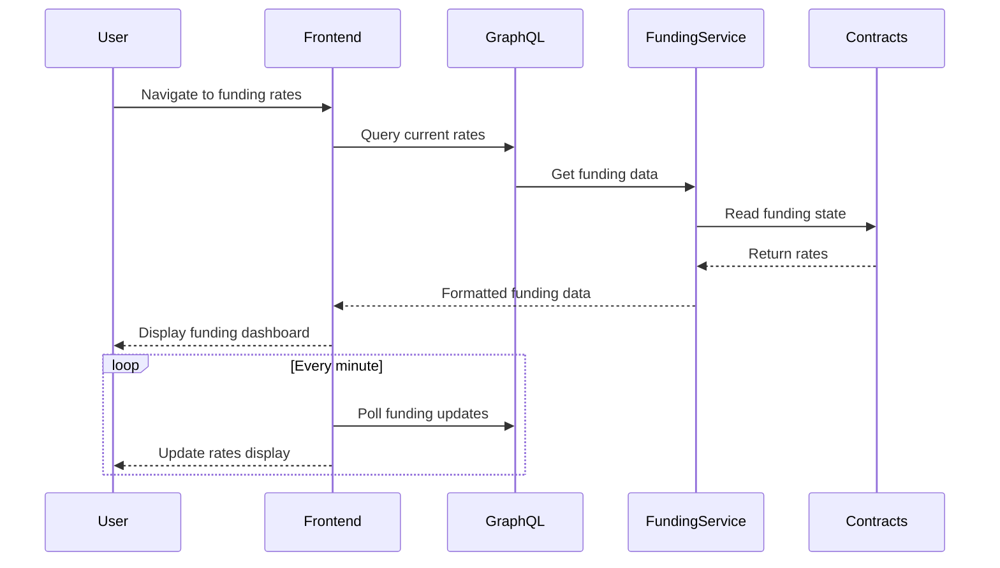

**Task Flow**:
1. Navigate to funding rates section
2. View current funding rates for all markets
3. See funding rate history and trends
4. Monitor funding rate predictions
5. Track funding costs for open positions

**Prerequisite Stories**: STAR-109

**Prerequisite Technical Stories**: 
- Funding rate mechanism in contracts (STAR-130)
- Funding data processing in indexer

**Acceptance Criteria**:
- **Functional Requirements**:
  - Funding rate dashboard showing all markets with current rates (% per 8 hours)
  - Historical funding chart with 1h, 24h, 7d, 30d views
  - Predicted funding rate based on open interest imbalance
  - Funding payment countdown timer (time until next payment)
  - Cumulative funding received/paid per position
  - Arbitrage opportunity indicator when rates diverge significantly
  - Funding rate heatmap for quick visual analysis
  
- **Non-Functional Requirements**:
  - Funding rate updates every minute
  - Historical data retention for 90 days
  - Predictive model accuracy > 80%
  - Dashboard load time < 2 seconds
  - Mobile-responsive layout
  - Real-time alerts for rate changes > 0.05%

**Unhappy Paths**:
  - Contract read failure uses cached rates
  - Missing historical data shows available range
  - Prediction model failure shows "unavailable"
  - Rate calculation errors trigger fallback formula

**Subtasks**:

- **UI/UX Design** (10 hours)
  - Required competencies: UI/UX Design, Data Visualization
  - Area of project modified: Funding Dashboard
  
- **Frontend Development** (20 hours)
  - Required competencies: React, TypeScript, Charting
  - Area of project modified: Funding Components
  - Details: Rate dashboard, historical charts, prediction display
  
- **Funding Calculations** (16 hours)
  - Required competencies: DeFi Mathematics, Financial Engineering
  - Area of project modified: Funding Service
  - Details: Rate calculation engine (STAR-130 subtask), prediction model
  
- **Data Pipeline** (12 hours)
  - Required competencies: Data Engineering, Time-series Analysis
  - Area of project modified: Indexer and GraphQL
  - Details: Funding event processing, aggregation queries
  
- **QA & Testing** (8 hours)
  - Required competencies: Financial Testing, Data Validation
  - Area of project modified: Test Suite

### STAR-115: Provide Liquidity (LP)

**Name**: Provide Liquidity (LP)

**Story**: As a liquidity provider, I want to deposit USDC into the liquidity pool to earn fees from traders while taking proportional house risk through RLP tokens.

**User Flow Diagram**:
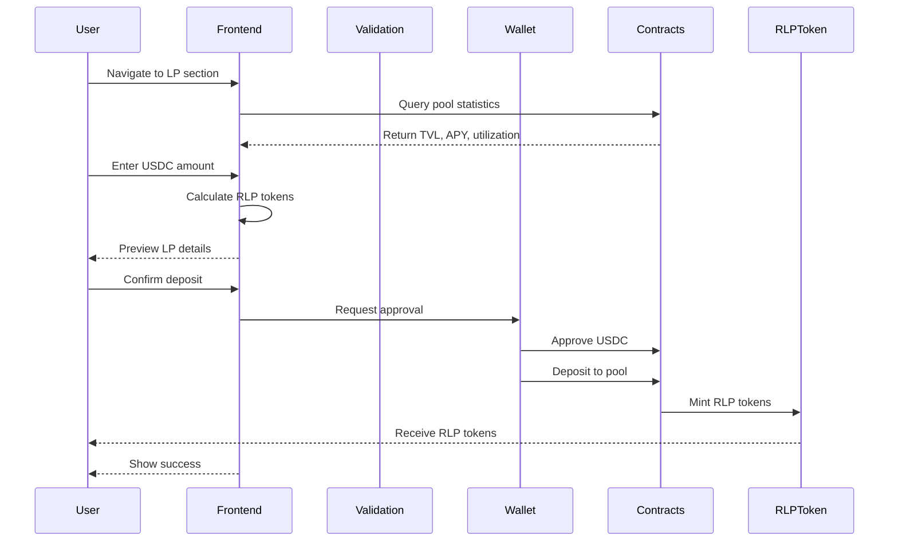

**Task Flow**:
1. Navigate to liquidity provision section
2. View current pool statistics (TVL, APY, utilization)
3. Enter USDC amount to deposit
4. Review RLP tokens to be received
5. Review transaction details and fees
6. Submit liquidity deposit transaction
7. Confirm transaction in wallet
8. Receive RLP tokens representing pool share

**Prerequisite Stories**: STAR-112

**Prerequisite Technical Stories**: 
- RLP token system implementation (STAR-131)
- Liquidity pool management in contracts

**Acceptance Criteria**:
- **Functional Requirements**:
  - Pool statistics display: TVL, 7-day APY, current utilization, total RLP supply
  - RLP token calculation: deposit_amount / pool_value * total_rlp_supply
  - Minimum deposit: 100 USDC
  - Maximum deposit: 10% of current TVL or $1M (whichever is lower)
  - Deposit fee: 0.1% (configurable)
  - RLP tokens received immediately upon confirmation
  - LP position appears in portfolio with real-time value
  
- **Non-Functional Requirements**:
  - APY calculation updated hourly
  - Pool statistics cached for 1 minute
  - Transaction completes within 60 seconds
  - Gas-optimized approval + deposit pattern
  - Comprehensive documentation of risks
  - Integration tests for edge cases

**Unhappy Paths**:
  - Insufficient USDC balance shows required amount
  - Pool capacity reached prevents deposit
  - Approval failure handled gracefully
  - RLP minting failure triggers revert
  - High utilization warning before deposit

**Subtasks**:

- **UI/UX Design** (8 hours)
  - Required competencies: UI/UX Design, DeFi Interfaces
  - Area of project modified: LP Interface
  
- **Frontend Development** (16 hours)
  - Required competencies: React, TypeScript, Web3
  - Area of project modified: LP Components
  - Details: Deposit form, pool statistics, RLP calculator
  
- **Smart Contract Development** (24 hours)
  - Required competencies: Sway/Fuel, DeFi Protocols
  - Area of project modified: Liquidity Pool Contract
  - Details: Deposit function, RLP minting logic (STAR-131 subtask)
  
- **RLP Token Integration** (16 hours)
  - Required competencies: Token Standards, DeFi
  - Area of project modified: RLP Token Contract
  - Details: Token minting, balance tracking (STAR-131 subtask)
  
- **QA & Testing** (12 hours)
  - Required competencies: DeFi Testing, Security Testing
  - Area of project modified: Test Suite

### STAR-116: Withdraw Liquidity (LP)

**Name**: Withdraw Liquidity (LP)

**Story**: As a liquidity provider, I want to withdraw my USDC from the liquidity pool when needed by burning RLP tokens and receiving my proportional share.

**User Flow Diagram**:
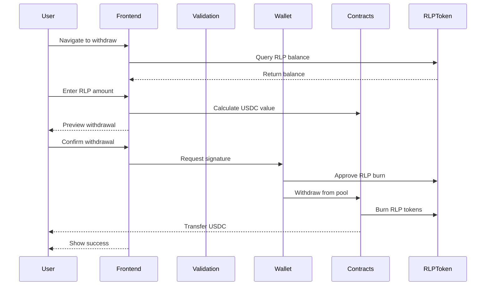

**Task Flow**:
1. Navigate to liquidity withdrawal section
2. View current RLP token balance
3. Enter amount of RLP tokens to burn
4. Review USDC amount to be received
5. Check for any withdrawal fees or cooldowns
6. Submit withdrawal transaction
7. Confirm transaction in wallet
8. Receive USDC and see updated RLP balance

**Prerequisite Stories**: STAR-115

**Prerequisite Technical Stories**: 
- RLP token burning mechanism (STAR-131)
- Withdrawal logic in contracts

**Acceptance Criteria**:
- **Functional Requirements**:
  - RLP balance display with current USDC value
  - USDC calculation: rlp_amount / total_rlp_supply * pool_value
  - Partial withdrawal support (minimum 10 RLP or 10%)
  - Withdrawal fee: 0.1% (configurable)
  - 24-hour cooldown period after deposit (configurable)
  - Immediate USDC transfer upon confirmation
  - Updated pool statistics after withdrawal
  
- **Non-Functional Requirements**:
  - Real-time RLP value updates
  - Withdrawal preview accuracy > 99.9%
  - Transaction completes within 60 seconds
  - Clear display of any lockup periods
  - Slippage protection for large withdrawals
  - Audit trail of all withdrawals

**Unhappy Paths**:
  - Cooldown period active shows time remaining
  - Insufficient pool liquidity delays withdrawal
  - RLP approval failure handled gracefully
  - Pool imbalance triggers withdrawal limit
  - Emergency withdrawal mode if pool is paused

**Subtasks**:

- **UI/UX Design** (6 hours)
  - Required competencies: UI/UX Design, DeFi Interfaces
  - Area of project modified: LP Interface
  
- **Frontend Development** (14 hours)
  - Required competencies: React, TypeScript, Web3
  - Area of project modified: LP Components
  - Details: Withdrawal form, cooldown timer, value calculator
  
- **Smart Contract Development** (20 hours)
  - Required competencies: Sway/Fuel, DeFi Protocols
  - Area of project modified: Liquidity Pool Contract
  - Details: Withdrawal function, RLP burning logic (STAR-131 subtask)
  
- **Cooldown Mechanism** (8 hours)
  - Required competencies: Smart Contracts, Time-locks
  - Area of project modified: Pool Contract
  - Details: Cooldown tracking, emergency withdrawal
  
- **QA & Testing** (10 hours)
  - Required competencies: DeFi Testing, Edge Cases
  - Area of project modified: Test Suite

### STAR-117: View LP Performance

**Name**: View LP Performance

**Story**: As a liquidity provider, I want to view my earnings from trading fees and my exposure to trader profits/losses so that I can track my liquidity provision performance.

**User Flow Diagram**:
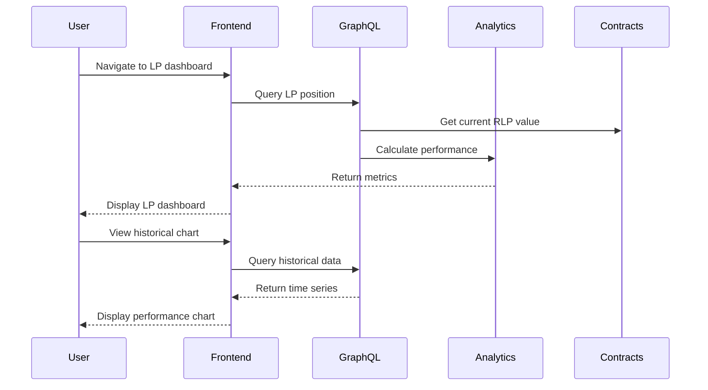

**Task Flow**:
1. Navigate to LP dashboard/analytics
2. View current RLP token value and share of pool
3. See earnings from trading fees over time
4. Monitor exposure to trader PnL
5. Track historical LP performance and returns
6. View pool utilization and risk metrics

**Prerequisite Stories**: STAR-115

**Prerequisite Technical Stories**: 
- LP analytics system (STAR-127)
- Fee distribution tracking in indexer

**Acceptance Criteria**:
- **Functional Requirements**:
  - Current position: RLP balance, USDC value, pool share %, unrealized P&L
  - Fee earnings breakdown: daily, weekly, monthly, all-time
  - Trader P&L exposure: current exposure, historical impact on returns
  - APY display: 7-day, 30-day, inception-to-date
  - Pool metrics: utilization rate, total fees collected, trader P&L
  - Performance chart with customizable time ranges
  - Risk metrics: max drawdown, volatility, Sharpe ratio
  
- **Non-Functional Requirements**:
  - Dashboard updates every minute
  - Historical data for 1 year
  - Chart renders 10,000+ data points smoothly
  - Mobile-optimized dashboard
  - CSV export for tax reporting
  - Real-time fee accrual display

**Unhappy Paths**:
  - No LP position shows demo dashboard
  - Incomplete data shows available range
  - Calculation errors fall back to contract data
  - High trader profits show risk warning

**Subtasks**:

- **UI/UX Design** (10 hours)
  - Required competencies: UI/UX Design, Dashboard Design
  - Area of project modified: LP Dashboard
  
- **Frontend Development** (20 hours)
  - Required competencies: React, TypeScript, Data Visualization
  - Area of project modified: LP Analytics Components
  - Details: Dashboard layout, performance charts, metrics display
  
- **Analytics Engine** (18 hours)
  - Required competencies: Financial Analytics, DeFi Metrics
  - Area of project modified: Analytics Service
  - Details: APY calculations, risk metrics (STAR-127 subtask), P&L attribution
  
- **Data Pipeline** (14 hours)
  - Required competencies: Data Engineering, GraphQL
  - Area of project modified: Indexer and GraphQL
  - Details: Fee event processing (STAR-135 subtask), historical aggregation
  
- **QA & Testing** (8 hours)
  - Required competencies: Analytics Testing, Data Validation
  - Area of project modified: Test Suite

### STAR-118: Handle Transaction Errors

**Name**: Handle Transaction Errors

**Story**: As a trader, I want to receive clear error messages when transactions fail or when I have insufficient collateral so that I can understand and resolve issues quickly.

**User Flow Diagram**:
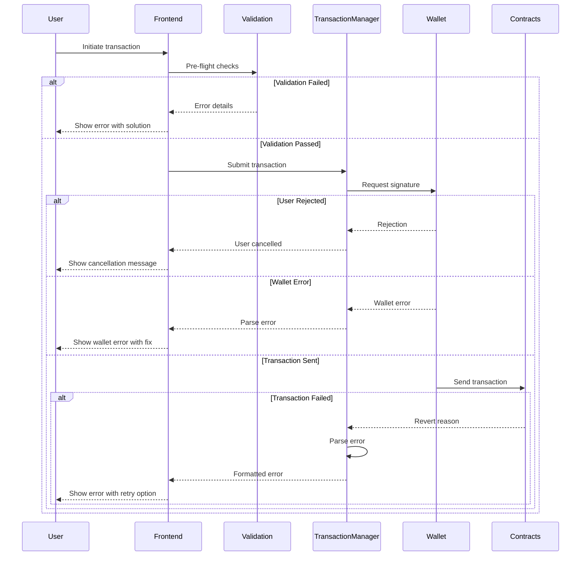

**Task Flow**:
1. Attempt a transaction (deposit, trade, withdrawal)
2. Encounter transaction failure or validation error
3. Receive clear, actionable error message
4. Understand the specific issue (insufficient balance, slippage, etc.)
5. Get guidance on how to resolve the problem
6. Retry transaction after addressing the issue

**Prerequisite Stories**: STAR-107, STAR-108

**Prerequisite Technical Stories**: 
- Transaction management system (STAR-124)

**Acceptance Criteria**:
- **Functional Requirements**:
  - Pre-flight validation for: insufficient balance, invalid parameters, network issues
  - Error categorization: user errors, network errors, contract errors, wallet errors
  - User-friendly error messages mapping technical errors to plain English
  - Suggested actions for each error type with actionable buttons
  - Retry mechanism with exponential backoff for network errors
  - Error tracking and analytics for monitoring common issues
  - Toast notifications for non-blocking errors
  - Modal dialogs for blocking errors requiring user action
  
- **Non-Functional Requirements**:
  - Error detection within 100ms for validation errors
  - Error message display within 500ms of failure
  - Retry attempts limited to 3 with increasing delays
  - Error logs sent to monitoring service
  - Localization support for error messages
  - Accessibility compliance for error displays

**Unhappy Paths**:
  - Unknown errors show generic message with support link
  - Repeated failures trigger cooldown period
  - Critical errors trigger emergency mode
  - Network timeout shows offline indicator

**Subtasks**:

- **UX Writing** (6 hours)
  - Required competencies: UX Writing, Technical Communication
  - Area of project modified: Error Messages
  
- **Error Handling System** (16 hours)
  - Required competencies: TypeScript, Error Management
  - Area of project modified: Transaction Manager
  - Details: Error parser, retry logic (STAR-124 subtask), recovery flows
  
- **Frontend Components** (12 hours)
  - Required competencies: React, TypeScript, UI Components
  - Area of project modified: Error Components
  - Details: Error modals, toast notifications, inline validation
  
- **Validation Layer** (10 hours)
  - Required competencies: Web3, Validation Logic
  - Area of project modified: Validation Service
  - Details: Pre-flight checks, parameter validation
  
- **QA & Testing** (12 hours)
  - Required competencies: Error Testing, E2E Testing
  - Area of project modified: Test Suite
  - Details: Error scenario testing, recovery testing

### STAR-119: View Funding Costs

**Name**: View Funding Costs

**Story**: As a trader, I want to understand the funding fees I'll pay based on my position length and open interest imbalances so that I can factor these costs into my trading decisions.

**User Flow Diagram**:
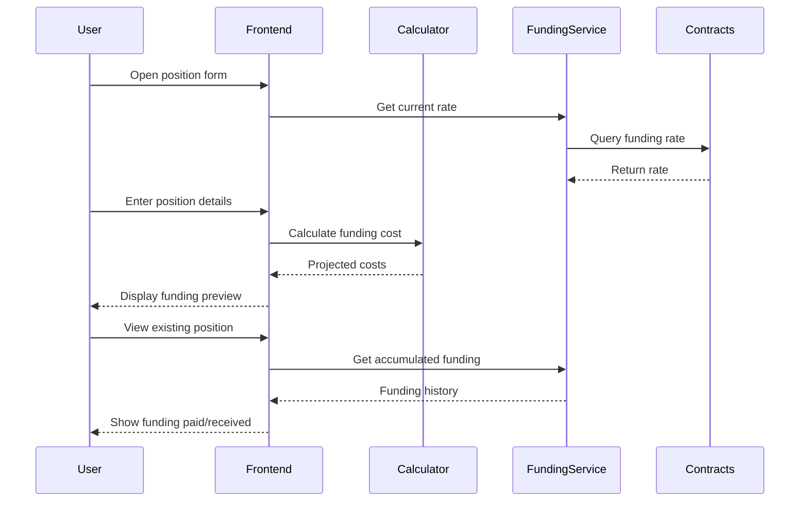

**Task Flow**:
1. View funding rate information before opening position
2. Monitor ongoing funding costs for open positions
3. Understand how funding rates are calculated
4. View funding payment history
5. Factor funding costs into position sizing

**Prerequisite Stories**: STAR-107, STAR-108, STAR-109

**Prerequisite Technical Stories**: 
- Funding rate mechanism (STAR-130)

**Acceptance Criteria**:
- **Functional Requirements**:
  - Funding rate display on position entry form (rate per 8 hours)
  - Cost calculator: position_size * funding_rate * (hours_held / 8)
  - Funding direction indicator (pay/receive based on long/short and rate)
  - Break-even calculator including funding costs
  - Accumulated funding display per position
  - Funding payment history with timestamps and amounts
  - Projected funding costs for 1 day, 7 days, 30 days
  
- **Non-Functional Requirements**:
  - Funding calculations update in real-time
  - Historical funding data for 90 days
  - Calculator accuracy to 6 decimal places
  - Mobile-friendly calculator interface
  - Funding rate API endpoint for external tools
  - Documentation of funding mechanism

**Unhappy Paths**:
  - Extreme funding rates trigger warning
  - Calculator overflow handled gracefully
  - Missing historical data shows available range
  - Negative rates clearly explained

**Subtasks**:

- **UI/UX Design** (6 hours)
  - Required competencies: UI/UX Design, Financial Calculators
  - Area of project modified: Trading Interface
  
- **Funding Calculator** (12 hours)
  - Required competencies: React, Financial Mathematics
  - Area of project modified: Calculator Components
  - Details: Cost calculator, break-even analysis, projections
  
- **Frontend Integration** (10 hours)
  - Required competencies: React, TypeScript
  - Area of project modified: Position Components
  - Details: Funding display integration, payment history
  
- **Data Processing** (8 hours)
  - Required competencies: GraphQL, Data Aggregation
  - Area of project modified: GraphQL Layer
  - Details: Funding aggregation queries, history processing
  
- **QA & Testing** (6 hours)
  - Required competencies: Calculator Testing, Math Validation
  - Area of project modified: Test Suite

### STAR-120: Select Network (Testnet/Mainnet)

**Name**: Select Network (Testnet/Mainnet)

**Story**: As a trader, I want to select between testnet and mainnet so that I can test the platform before using it with real funds or switch to the production environment.

**User Flow Diagram**:
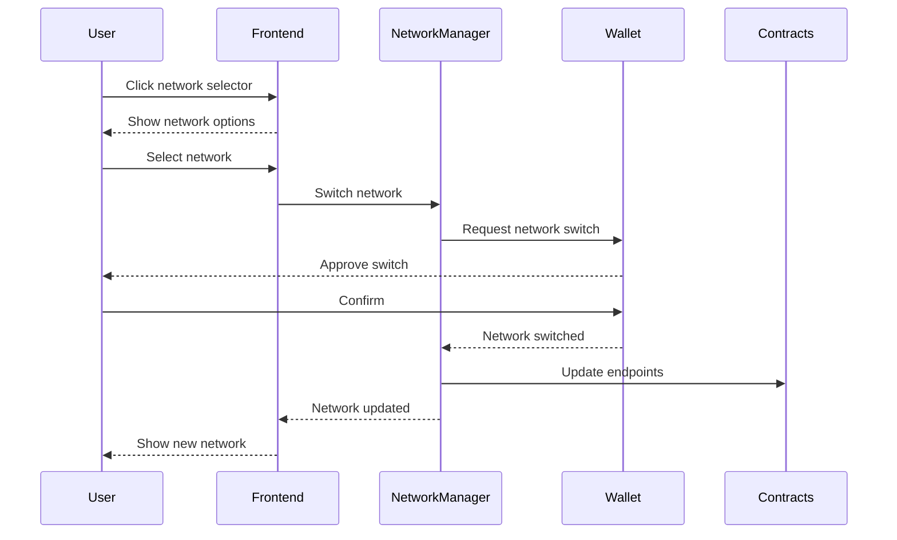

**Task Flow**:
1. Visit Starboard Finance platform
2. See network selector in header or settings
3. Choose between Testnet and Mainnet
4. Confirm network switching
5. See updated network indicator
6. Wallet automatically switches to correct network

**Prerequisite Stories**: STAR-112

**Prerequisite Technical Stories**: 
- Multi-network contract deployment (STAR-128)
- Network configuration in frontend

**Acceptance Criteria**:
- **Functional Requirements**:
  - Network selector in header showing current network
  - Clear visual distinction: Testnet (orange), Mainnet (green)
  - Network switch updates: contract addresses, RPC endpoints, indexer URLs
  - Wallet network validation and auto-switch prompt
  - Data isolation between networks (no testnet data on mainnet)
  - Network preference saved in localStorage
  - URL parameter support for network selection (?network=testnet)
  
- **Non-Functional Requirements**:
  - Network switch completed within 3 seconds
  - No data loss during network switch
  - Clear warning when switching to mainnet
  - Automatic reconnection after switch
  - Network status monitoring
  - Fallback RPC endpoints for reliability

**Unhappy Paths**:
  - Wallet on wrong network prompts switch
  - Network switch failure maintains current network
  - RPC unavailable shows maintenance message
  - Unsupported network shows error

**Subtasks**:

- **UI/UX Design** (4 hours)
  - Required competencies: UI/UX Design, Network Indicators
  - Area of project modified: Header Component
  
- **Network Management** (12 hours)
  - Required competencies: Web3, Network Configuration
  - Area of project modified: Network Service
  - Details: Network switching logic, configuration management
  
- **Frontend Integration** (8 hours)
  - Required competencies: React, TypeScript
  - Area of project modified: Header and App Components
  - Details: Network selector, visual indicators, state management
  
- **Contract Configuration** (6 hours)
  - Required competencies: Smart Contracts, Multi-chain
  - Area of project modified: Contract Configs
  - Details: Network-specific addresses, ABI management
  
- **QA & Testing** (8 hours)
  - Required competencies: Network Testing, E2E Testing
  - Area of project modified: Test Suite
  - Details: Network switch scenarios, data isolation testing

---

## Summary

This comprehensive breakdown reorganizes the project into three clear EPICs:

1. **Architecture EPIC**: 7 documentation and design stories for system architecture
2. **Cloud Infrastructure EPIC**: 10 actual infrastructure stories for platform deployment
3. **Implementation EPIC**: 15 detailed user stories with comprehensive subtasks

Key improvements in this reorganization:
- Moved functional requirements (wallet integration, trading interface, etc.) from Cloud Infrastructure to become subtasks within relevant user stories
- Created proper infrastructure stories for actual cloud/DevOps needs
- Each user story now includes detailed subtasks referencing the original technical stories as implementation details
- Maintained traceability while properly categorizing work

Total estimated effort: ~2,400 hours across all competencies and project areas.